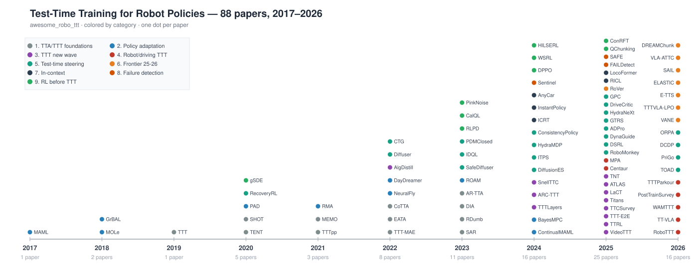

# Awesome Robot Test-Time Training (awesome_robo_ttt)

English | [中文](README.md)

A curated list of resources on **Test-Time Training / Test-Time Adaptation / Test-Time Scaling for robot policies and autonomous driving** — how deployed embodied agents keep learning after training ends.

**What you get**

- 📄 **88 papers**, every one with the English PDF (`papers/pdf/`)
- 🇨🇳 Layout-preserving **Chinese translations** (`papers/zh/`, via [SuperTranslate](https://github.com/asimfish/super_translate))
- 📝 **Per-paper reading notes** in Chinese (`notes/`): method breakdown, key numbers, relevance to robot TTT, limitations, related reading
- 💡 [Trends & Insights](insights/TRENDS_AND_INSIGHTS.md) (9 trends · 5 core insights · open problems), a [Design-Space Matrix](insights/DESIGN_SPACE_MATRIX.md) (34 methods × 7 dimensions) and a [Research Roadmap](insights/OUR_ROADMAP.md)
- 📐 [Research proposal v2](proposal/CADI_TTT_PROPOSAL_v2.md) ([HTML](proposal/CADI_TTT_PROPOSAL_v2.html), in Chinese): structured action interfaces as the safety shell for deployment-time adaptation — formal method, four propositions with numerical checks, pre-registered experiments and kill criteria
- 📊 Summary reports: [HTML slides](report/robo_ttt_report.html) · [Beamer PDF](report/robo_ttt_report.pdf)
- 📚 [BibTeX for all entries](awesome_robo_ttt.bib)

*Maintained by [asimfish](https://github.com/asimfish). Contributions welcome — see [CONTRIBUTING.md](CONTRIBUTING.md).*

## Contents

1. [Foundations of TTA/TTT](#1-foundations-of-ttattt)
2. [Deployment-Time Policy Adaptation](#2-deployment-time-policy-adaptation)
3. [The New Wave of TTT](#3-the-new-wave-of-ttt)
4. [Weight-Level TTT for Robots & Driving](#4-weight-level-ttt-for-robots--driving)
5. [Test-Time Steering without Weight Updates](#5-test-time-steering-without-weight-updates)
6. [Frontier 2025–2026](#6-frontier-20252026)
7. [In-Context Adaptation for Robots](#7-in-context-adaptation-for-robots)
8. [Failure Detection & Adaptation Triggers](#8-failure-detection--adaptation-triggers)
9. [RL Fine-Tuning & Smooth Exploration before TTT](#9-rl-fine-tuning--smooth-exploration-before-ttt)
10. [Benchmarks & Simulators](#benchmarks--simulators)

## 1. Foundations of TTA/TTT

Where TTT came from, when it works (TTT++), how it collapses (SAR/RDumb) and the attack surface it opens (DIA).

1. **Test-Time Training with Self-Supervision for Generalization under Distribution Shifts.** ICML 2020. [paper](https://arxiv.org/abs/1909.13231) [pdf](papers/pdf/TTT_1909.13231.pdf) [zh-pdf](papers/zh/TTT_1909.13231_zh.pdf) [notes (zh)](notes/TTT_1909.13231.md)

2. **Test-Time Training with Masked Autoencoders.** NeurIPS 2022. [paper](https://arxiv.org/abs/2209.07522) [pdf](papers/pdf/TTT-MAE_2209.07522.pdf) [zh-pdf](papers/zh/TTT-MAE_2209.07522_zh.pdf) [notes (zh)](notes/TTT-MAE_2209.07522.md)

3. **TTT++: When Does Self-Supervised Test-Time Training Fail or Thrive?.** NeurIPS 2021. [paper](https://proceedings.neurips.cc/paper/2021/file/b618c3210e934362ac261db280128c22-Paper.pdf) [pdf](papers/pdf/TTTpp_NEURIPS2021.pdf) [zh-pdf](papers/zh/TTTpp_NEURIPS2021_zh.pdf) [notes (zh)](notes/TTTpp_NEURIPS2021.md)

4. **Tent: Fully Test-Time Adaptation by Entropy Minimization.** ICLR 2021. [paper](https://arxiv.org/abs/2006.10726) [pdf](papers/pdf/TENT_2006.10726.pdf) [zh-pdf](papers/zh/TENT_2006.10726_zh.pdf) [notes (zh)](notes/TENT_2006.10726.md)

5. **Towards Stable Test-Time Adaptation in Dynamic Wild World.** ICLR 2023. [paper](https://arxiv.org/abs/2302.12400) [pdf](papers/pdf/SAR_2302.12400.pdf) [zh-pdf](papers/zh/SAR_2302.12400_zh.pdf) [notes (zh)](notes/SAR_2302.12400.md)

6. **Efficient Test-Time Model Adaptation without Forgetting.** ICML 2022. [paper](https://arxiv.org/abs/2204.02610) [pdf](papers/pdf/EATA_2204.02610.pdf) [zh-pdf](papers/zh/EATA_2204.02610_zh.pdf) [notes (zh)](notes/EATA_2204.02610.md)

7. **Continual Test-Time Domain Adaptation.** CVPR 2022. [paper](https://arxiv.org/abs/2203.13591) [pdf](papers/pdf/CoTTA_2203.13591.pdf) [zh-pdf](papers/zh/CoTTA_2203.13591_zh.pdf) [notes (zh)](notes/CoTTA_2203.13591.md)

8. **RDumb: A Simple Approach that Questions Our Progress in Continual Test-Time Adaptation.** NeurIPS 2023. [paper](https://arxiv.org/abs/2306.05401) [pdf](papers/pdf/RDumb_2306.05401.pdf) [zh-pdf](papers/zh/RDumb_2306.05401_zh.pdf) [notes (zh)](notes/RDumb_2306.05401.md)

9. **Uncovering Adversarial Risks of Test-Time Adaptation.** ICML 2023. [paper](https://arxiv.org/abs/2301.12576) [pdf](papers/pdf/DIA_2301.12576.pdf) [zh-pdf](papers/zh/DIA_2301.12576_zh.pdf) [notes (zh)](notes/DIA_2301.12576.md)

10. **Do We Really Need to Access the Source Data? Source Hypothesis Transfer for Unsupervised Domain Adaptation.** ICML 2020. [paper](https://arxiv.org/abs/2002.08546) [pdf](papers/pdf/SHOT_2002.08546.pdf) [zh-pdf](papers/zh/SHOT_2002.08546_zh.pdf) [notes (zh)](notes/SHOT_2002.08546.md)

11. **MEMO: Test Time Robustness via Adaptation and Augmentation.** NeurIPS 2022. [paper](https://arxiv.org/abs/2110.09506) [pdf](papers/pdf/MEMO_2110.09506.pdf) [zh-pdf](papers/zh/MEMO_2110.09506_zh.pdf) [notes (zh)](notes/MEMO_2110.09506.md)

12. **AR-TTA: A Simple Method for Real-World Continual Test-Time Adaptation.** ICCVW 2023. [paper](https://arxiv.org/abs/2309.10109) [pdf](papers/pdf/AR-TTA_2309.10109.pdf) [zh-pdf](papers/zh/AR-TTA_2309.10109_zh.pdf) [notes (zh)](notes/AR-TTA_2309.10109.md)

## 2. Deployment-Time Policy Adaptation

Robotics classics: self-supervised gradients (PAD), gradient-free inference (RMA), online meta-learning (MOLe/GrBAL/MAML), provably-stable low-dimensional adaptation (Neural-Fly), world-model learning on real robots (DayDreamer), and the speed limit of online adaptation (BayesMPC).

1. **Self-Supervised Policy Adaptation during Deployment.** ICLR 2021. [paper](https://arxiv.org/abs/2007.04309) [pdf](papers/pdf/PAD_2007.04309.pdf) [zh-pdf](papers/zh/PAD_2007.04309_zh.pdf) [notes (zh)](notes/PAD_2007.04309.md)

2. **RMA: Rapid Motor Adaptation for Legged Robots.** RSS 2021. [paper](https://arxiv.org/abs/2107.04034) [pdf](papers/pdf/RMA_2107.04034.pdf) [zh-pdf](papers/zh/RMA_2107.04034_zh.pdf) [notes (zh)](notes/RMA_2107.04034.md)

3. **Deep Online Learning via Meta-Learning: Continual Adaptation for Model-Based RL.** arXiv 2018. [paper](https://arxiv.org/abs/1812.07671) [pdf](papers/pdf/MOLe_1812.07671.pdf) [zh-pdf](papers/zh/MOLe_1812.07671_zh.pdf) [notes (zh)](notes/MOLe_1812.07671.md)

4. **Neural-Fly Enables Rapid Learning for Agile Flight in Strong Winds.** Science Robotics 2022. [paper](https://arxiv.org/abs/2205.06908) [pdf](papers/pdf/NeuralFly_2205.06908.pdf) [zh-pdf](papers/zh/NeuralFly_2205.06908_zh.pdf) [notes (zh)](notes/NeuralFly_2205.06908.md)

5. **Online Adaptation of Learned Vehicle Dynamics Model with Meta-Learning Approach.** IROS 2024. [paper](https://arxiv.org/abs/2409.14950) [pdf](papers/pdf/ContinualMAML_2409.14950.pdf) [zh-pdf](papers/zh/ContinualMAML_2409.14950_zh.pdf) [notes (zh)](notes/ContinualMAML_2409.14950.md)

6. **First, Learn What You Don't Know: Active Information Gathering for Driving at the Limits of Handling.** arXiv 2024. [paper](https://arxiv.org/abs/2411.00107) [pdf](papers/pdf/BayesMPC_2411.00107.pdf) [zh-pdf](papers/zh/BayesMPC_2411.00107_zh.pdf) [notes (zh)](notes/BayesMPC_2411.00107.md)

7. **Model-Agnostic Meta-Learning for Fast Adaptation of Deep Networks.** ICML 2017. [paper](https://arxiv.org/abs/1703.03400) [pdf](papers/pdf/MAML_1703.03400.pdf) [zh-pdf](papers/zh/MAML_1703.03400_zh.pdf) [notes (zh)](notes/MAML_1703.03400.md)

8. **Learning to Adapt in Dynamic, Real-World Environments Through Meta-Reinforcement Learning.** ICLR 2019. [paper](https://arxiv.org/abs/1803.11347) [pdf](papers/pdf/GrBAL_1803.11347.pdf) [zh-pdf](papers/zh/GrBAL_1803.11347_zh.pdf) [notes (zh)](notes/GrBAL_1803.11347.md)

9. **DayDreamer: World Models for Physical Robot Learning.** CoRL 2022. [paper](https://arxiv.org/abs/2206.14176) [pdf](papers/pdf/DayDreamer_2206.14176.pdf) [zh-pdf](papers/zh/DayDreamer_2206.14176_zh.pdf) [notes (zh)](notes/DayDreamer_2206.14176.md)

10. **Adapt On-the-Go: Behavior Modulation for Single-Life Robot Deployment.** CoLLAs 2025. [paper](https://arxiv.org/abs/2311.01059) [pdf](papers/pdf/ROAM_2311.01059.pdf) [zh-pdf](papers/zh/ROAM_2311.01059_zh.pdf) [notes (zh)](notes/ROAM_2311.01059.md)

## 3. The New Wave of TTT

2024–2026: TTT becomes a network layer (TTT-Layers/Titans/LaCT), scales to few-shot reasoning (ARC), video, and test-time RL (TTRL); efficient training of TTT layers (TNT).

1. **Learning to (Learn at Test Time): RNNs with Expressive Hidden States.** ICML 2025. [paper](https://arxiv.org/abs/2407.04620) [pdf](papers/pdf/TTTLayers_2407.04620.pdf) [zh-pdf](papers/zh/TTTLayers_2407.04620_zh.pdf) [notes (zh)](notes/TTTLayers_2407.04620.md)

2. **The Surprising Effectiveness of Test-Time Training for Few-Shot Learning.** ICML 2025. [paper](https://arxiv.org/abs/2411.07279) [pdf](papers/pdf/ARC-TTT_2411.07279.pdf) [zh-pdf](papers/zh/ARC-TTT_2411.07279_zh.pdf) [notes (zh)](notes/ARC-TTT_2411.07279.md)

3. **One-Minute Video Generation with Test-Time Training.** CVPR 2025. [paper](https://arxiv.org/abs/2504.05298) [pdf](papers/pdf/VideoTTT_2504.05298.pdf) [zh-pdf](papers/zh/VideoTTT_2504.05298_zh.pdf) [notes (zh)](notes/VideoTTT_2504.05298.md)

4. **TTRL: Test-Time Reinforcement Learning.** NeurIPS 2025. [paper](https://arxiv.org/abs/2504.16084) [pdf](papers/pdf/TTRL_2504.16084.pdf) [zh-pdf](papers/zh/TTRL_2504.16084_zh.pdf) [notes (zh)](notes/TTRL_2504.16084.md)

5. **In-context Reinforcement Learning with Algorithm Distillation.** ICLR 2023. [paper](https://arxiv.org/abs/2210.14215) [pdf](papers/pdf/AlgDistill_2210.14215.pdf) [zh-pdf](papers/zh/AlgDistill_2210.14215_zh.pdf) [notes (zh)](notes/AlgDistill_2210.14215.md)

6. **End-to-End Test-Time Training for Long Context.** arXiv 2025. [paper](https://arxiv.org/abs/2512.23675) [pdf](papers/pdf/TTT-E2E_2512.23675.pdf) [zh-pdf](papers/zh/TTT-E2E_2512.23675_zh.pdf) [notes (zh)](notes/TTT-E2E_2512.23675.md)

7. **Scaling LLM Test-Time Compute Optimally Can Be More Effective than Scaling Model Parameters.** arXiv 2024. [paper](https://arxiv.org/abs/2408.03314) [pdf](papers/pdf/SnellTTC_2408.03314.pdf) [zh-pdf](papers/zh/SnellTTC_2408.03314_zh.pdf) [notes (zh)](notes/SnellTTC_2408.03314.md)

8. **A Survey of Test-Time Compute: From Intuitive Inference to Deliberate Reasoning.** arXiv 2025. [paper](https://arxiv.org/abs/2501.02497) [pdf](papers/pdf/TTCSurvey_2501.02497.pdf) [zh-pdf](papers/zh/TTCSurvey_2501.02497_zh.pdf) [notes (zh)](notes/TTCSurvey_2501.02497.md)

9. **Titans: Learning to Memorize at Test Time.** NeurIPS 2025. [paper](https://arxiv.org/abs/2501.00663) [pdf](papers/pdf/Titans_2501.00663.pdf) [zh-pdf](papers/zh/Titans_2501.00663_zh.pdf) [notes (zh)](notes/Titans_2501.00663.md)

10. **Test-Time Training Done Right.** arXiv 2025. [paper](https://arxiv.org/abs/2505.23884) [pdf](papers/pdf/LaCT_2505.23884.pdf) [zh-pdf](papers/zh/LaCT_2505.23884_zh.pdf) [notes (zh)](notes/LaCT_2505.23884.md)

11. **ATLAS: Learning to Optimally Memorize the Context at Test Time.** arXiv 2025. [paper](https://arxiv.org/abs/2505.23735) [pdf](papers/pdf/ATLAS_2505.23735.pdf) [zh-pdf](papers/zh/ATLAS_2505.23735_zh.pdf) [notes (zh)](notes/ATLAS_2505.23735.md)

12. **TNT: Improving Chunkwise Training for Test-Time Memorization.** arXiv 2025. [paper](https://arxiv.org/abs/2511.07343) [pdf](papers/pdf/TNT_2511.07343.pdf) [zh-pdf](papers/zh/TNT_2511.07343_zh.pdf) [notes (zh)](notes/TNT_2511.07343.md)

## 4. Weight-Level TTT for Robots & Driving

Milestones: RoboTTT (30 Hz real-robot TTT layers), Centaur (TTT on the navtest leaderboard), WAM-TTT (learning from human video at test time), TTT-Parkour (real-to-sim-to-real segment-level TTT).

1. **RoboTTT: Context Scaling for Robot Policies.** arXiv 2026. [paper](https://arxiv.org/abs/2607.15275) [pdf](papers/pdf/RoboTTT_2607.15275.pdf) [zh-pdf](papers/zh/RoboTTT_2607.15275_zh.pdf) [notes (zh)](notes/RoboTTT_2607.15275.md)

2. **On-the-Fly VLA Adaptation via Test-Time Reinforcement Learning.** arXiv 2026. [paper](https://arxiv.org/abs/2601.06748) [pdf](papers/pdf/TT-VLA_2601.06748.pdf) [zh-pdf](papers/zh/TT-VLA_2601.06748_zh.pdf) [notes (zh)](notes/TT-VLA_2601.06748.md)

3. **Centaur: Robust End-to-End Autonomous Driving with Test-Time Training.** arXiv 2025. [paper](https://arxiv.org/abs/2503.11650) [pdf](papers/pdf/Centaur_2503.11650.pdf) [zh-pdf](papers/zh/Centaur_2503.11650_zh.pdf) [notes (zh)](notes/Centaur_2503.11650.md)

4. **Model-Based Policy Adaptation for Closed-Loop End-to-End Autonomous Driving.** arXiv 2025. [paper](https://arxiv.org/abs/2511.21584) [pdf](papers/pdf/MPA_2511.21584.pdf) [zh-pdf](papers/zh/MPA_2511.21584_zh.pdf) [notes (zh)](notes/MPA_2511.21584.md)

5. **WAM-TTT: Steering World-Action Models by Watching Human Play at Test Time.** arXiv 2026. [paper](https://arxiv.org/abs/2607.06988) [pdf](papers/pdf/WAMTTT_2607.06988.pdf) [zh-pdf](papers/zh/WAMTTT_2607.06988_zh.pdf) [notes (zh)](notes/WAMTTT_2607.06988.md)

6. **Post-Training in End-to-End Autonomous Driving: A Unified View.** arXiv 2026. [paper](https://arxiv.org/abs/2607.08072) [pdf](papers/pdf/PostTrainSurvey_2607.08072.pdf) [zh-pdf](papers/zh/PostTrainSurvey_2607.08072_zh.pdf) [notes (zh)](notes/PostTrainSurvey_2607.08072.md)

7. **TTT-Parkour: Rapid Test-Time Training for Perceptive Robot Parkour.** arXiv 2026. [paper](https://arxiv.org/abs/2602.02331) [pdf](papers/pdf/TTTParkour_2602.02331.pdf) [zh-pdf](papers/zh/TTTParkour_2602.02331_zh.pdf) [notes (zh)](notes/TTTParkour_2602.02331.md)

## 5. Test-Time Steering without Weight Updates

Guidance, best-of-N with critics/verifiers, evolutionary/CEM search, noise-space RL (DSRL), policy composition (GPC), chunk-level correction, driving verifier stacks, and latency enablers.

1. **Planning with Diffusion for Flexible Behavior Synthesis.** ICML 2022. [paper](https://arxiv.org/abs/2205.09991) [pdf](papers/pdf/Diffuser_2205.09991.pdf) [zh-pdf](papers/zh/Diffuser_2205.09991_zh.pdf) [notes (zh)](notes/Diffuser_2205.09991.md)

2. **Guided Conditional Diffusion for Controllable Traffic Simulation.** ICRA 2023. [paper](https://arxiv.org/abs/2210.17366) [pdf](papers/pdf/CTG_2210.17366.pdf) [zh-pdf](papers/zh/CTG_2210.17366_zh.pdf) [notes (zh)](notes/CTG_2210.17366.md)

3. **SafeDiffuser: Safe Planning with Diffusion Probabilistic Models.** ICLR 2025. [paper](https://arxiv.org/abs/2306.00148) [pdf](papers/pdf/SafeDiffuser_2306.00148.pdf) [zh-pdf](papers/zh/SafeDiffuser_2306.00148_zh.pdf) [notes (zh)](notes/SafeDiffuser_2306.00148.md)

4. **IDQL: Implicit Q-Learning as an Actor-Critic Method with Diffusion Policies.** arXiv 2023. [paper](https://arxiv.org/abs/2304.10573) [pdf](papers/pdf/IDQL_2304.10573.pdf) [zh-pdf](papers/zh/IDQL_2304.10573_zh.pdf) [notes (zh)](notes/IDQL_2304.10573.md)

5. **Recovery RL: Safe Reinforcement Learning with Learned Recovery Zones.** RA-L 2021. [paper](https://arxiv.org/abs/2010.15920) [pdf](papers/pdf/RecoveryRL_2010.15920.pdf) [zh-pdf](papers/zh/RecoveryRL_2010.15920_zh.pdf) [notes (zh)](notes/RecoveryRL_2010.15920.md)

6. **RoboMonkey: Scaling Test-Time Sampling and Verification for Vision-Language-Action Models.** CoRL 2025. [paper](https://arxiv.org/abs/2506.17811) [pdf](papers/pdf/RoboMonkey_2506.17811.pdf) [zh-pdf](papers/zh/RoboMonkey_2506.17811_zh.pdf) [notes (zh)](notes/RoboMonkey_2506.17811.md)

7. **Diffusion-ES: Gradient-free Planning with Diffusion for Autonomous Driving.** CVPR 2024. [paper](https://arxiv.org/abs/2402.06559) [pdf](papers/pdf/DiffusionES_2402.06559.pdf) [zh-pdf](papers/zh/DiffusionES_2402.06559_zh.pdf) [notes (zh)](notes/DiffusionES_2402.06559.md)

8. **Test-Time Trajectory Optimization for Autonomous Driving.** arXiv 2026. [paper](https://arxiv.org/abs/2606.07170) [pdf](papers/pdf/TOAD_2606.07170.pdf) [zh-pdf](papers/zh/TOAD_2606.07170_zh.pdf) [notes (zh)](notes/TOAD_2606.07170.md)

9. **Steering Your Diffusion Policy with Latent Space Reinforcement Learning.** CoRL 2025. [paper](https://arxiv.org/abs/2506.15799) [pdf](papers/pdf/DSRL_2506.15799.pdf) [zh-pdf](papers/zh/DSRL_2506.15799_zh.pdf) [notes (zh)](notes/DSRL_2506.15799.md)

10. **Inference-Time Policy Steering through Human Interactions.** ICRA 2025. [paper](https://arxiv.org/abs/2411.16627) [pdf](papers/pdf/ITPS_2411.16627.pdf) [zh-pdf](papers/zh/ITPS_2411.16627_zh.pdf) [notes (zh)](notes/ITPS_2411.16627.md)

11. **DynaGuide: Steering Diffusion Policies with Active Dynamic Guidance.** NeurIPS 2025. [paper](https://arxiv.org/abs/2506.13922) [pdf](papers/pdf/DynaGuide_2506.13922.pdf) [zh-pdf](papers/zh/DynaGuide_2506.13922_zh.pdf) [notes (zh)](notes/DynaGuide_2506.13922.md)

12. **Parting with Misconceptions about Learning-based Vehicle Motion Planning.** CoRL 2023. [paper](https://arxiv.org/abs/2306.07962) [pdf](papers/pdf/PDMClosed_2306.07962.pdf) [zh-pdf](papers/zh/PDMClosed_2306.07962_zh.pdf) [notes (zh)](notes/PDMClosed_2306.07962.md)

13. **Hydra-MDP: End-to-end Multimodal Planning with Multi-target Hydra-Distillation.** CVPRW 2024. [paper](https://arxiv.org/abs/2406.06978) [pdf](papers/pdf/HydraMDP_2406.06978.pdf) [zh-pdf](papers/zh/HydraMDP_2406.06978_zh.pdf) [notes (zh)](notes/HydraMDP_2406.06978.md)

14. **Consistency Policy: Accelerated Visuomotor Policies via Consistency Distillation.** RSS 2024. [paper](https://arxiv.org/abs/2405.07503) [pdf](papers/pdf/ConsistencyPolicy_2405.07503.pdf) [zh-pdf](papers/zh/ConsistencyPolicy_2405.07503_zh.pdf) [notes (zh)](notes/ConsistencyPolicy_2405.07503.md)

15. **ADPro: A Test-time Adaptive Diffusion Policy via Manifold-constrained Denoising and Task-aware Initialization.** arXiv 2025. [paper](https://arxiv.org/abs/2508.06266) [pdf](papers/pdf/ADPro_2508.06266.pdf) [zh-pdf](papers/zh/ADPro_2508.06266_zh.pdf) [notes (zh)](notes/ADPro_2508.06266.md)

16. **Generalized Trajectory Scoring for End-to-end Multimodal Planning.** arXiv 2025. [paper](https://arxiv.org/abs/2506.06664) [pdf](papers/pdf/GTRS_2506.06664.pdf) [zh-pdf](papers/zh/GTRS_2506.06664_zh.pdf) [notes (zh)](notes/GTRS_2506.06664.md)

17. **Hydra-NeXt: Robust Closed-Loop Driving with Open-Loop Training.** ICCV 2025. [paper](https://arxiv.org/abs/2503.12030) [pdf](papers/pdf/HydraNeXt_2503.12030.pdf) [zh-pdf](papers/zh/HydraNeXt_2503.12030_zh.pdf) [notes (zh)](notes/HydraNeXt_2503.12030.md)

18. **DriveCritic: Towards Context-Aware, Human-Aligned Evaluation for Autonomous Driving with Vision-Language Models.** arXiv 2025. [paper](https://arxiv.org/abs/2510.13108) [pdf](papers/pdf/DriveCritic_2510.13108.pdf) [zh-pdf](papers/zh/DriveCritic_2510.13108_zh.pdf) [notes (zh)](notes/DriveCritic_2510.13108.md)

19. **Compose Your Policies! Improving Diffusion-based or Flow-based Robot Policies via Test-time Distribution-level Composition.** ICLR 2026. [paper](https://arxiv.org/abs/2510.01068) [pdf](papers/pdf/GPC_2510.01068.pdf) [zh-pdf](papers/zh/GPC_2510.01068_zh.pdf) [notes (zh)](notes/GPC_2510.01068.md)

20. **PriGo: Test-Time Primitive Guidance to Diffusion and Flow Policies for Adaptive Robotic Manipulation.** arXiv 2026. [paper](https://arxiv.org/abs/2607.07076) [pdf](papers/pdf/PriGo_2607.07076.pdf) [zh-pdf](papers/zh/PriGo_2607.07076_zh.pdf) [notes (zh)](notes/PriGo_2607.07076.md)

21. **Closed-Loop Action Chunks with Dynamic Corrections for Training-Free Diffusion Policy.** arXiv 2026. [paper](https://arxiv.org/abs/2603.01953) [pdf](papers/pdf/DCDP_2603.01953.pdf) [zh-pdf](papers/zh/DCDP_2603.01953_zh.pdf) [notes (zh)](notes/DCDP_2603.01953.md)

22. **ORPA: Online Residual Policy Adaptation for Robot Manipulation Control with Human Feedback.** arXiv 2026. [paper](https://arxiv.org/abs/2608.17323) [pdf](papers/pdf/ORPA_2608.17323.pdf) [zh-pdf](papers/zh/ORPA_2608.17323_zh.pdf) [notes (zh)](notes/ORPA_2608.17323.md)

## 6. Frontier 2025–2026

Reliability protocols (VANE), latent-prompt interfaces (TTT-VLA), PRM verifiers (RoVer), embodied TTS frameworks (E-TTS), adaptive compute (ELASTIC/VLA-ATTC), trajectory-level MCTS (SAIL), world-model chunk switching (DREAM-Chunk).

1. **VANE: Reliable Test-Time Training for Vision-Language-Action Models via Future Visual Representation Prediction.** arXiv 2026. [paper](https://arxiv.org/abs/2608.09448) [pdf](papers/pdf/VANE_2608.09448.pdf) [zh-pdf](papers/zh/VANE_2608.09448_zh.pdf) [notes (zh)](notes/VANE_2608.09448.md)

2. **TTT-VLA: Test-Time Latent Prompt Optimization for Vision-Language-Action Models.** arXiv 2026. [paper](https://arxiv.org/abs/2606.03127) [pdf](papers/pdf/TTTVLA-LPO_2606.03127.pdf) [zh-pdf](papers/zh/TTTVLA-LPO_2606.03127_zh.pdf) [notes (zh)](notes/TTTVLA-LPO_2606.03127.md)

3. **RoVer: Robot Reward Model as Test-Time Verifier for Vision-Language-Action Model.** arXiv 2025. [paper](https://arxiv.org/abs/2510.10975) [pdf](papers/pdf/RoVer_2510.10975.pdf) [zh-pdf](papers/zh/RoVer_2510.10975_zh.pdf) [notes (zh)](notes/RoVer_2510.10975.md)

4. **E-TTS: A New Embodied Test-Time Scaling Framework for Robotic Manipulation.** arXiv 2026. [paper](https://arxiv.org/abs/2606.27268) [pdf](papers/pdf/E-TTS_2606.27268.pdf) [zh-pdf](papers/zh/E-TTS_2606.27268_zh.pdf) [notes (zh)](notes/E-TTS_2606.27268.md)

5. **ELASTIC: Efficiently Learning to Adaptively Scale Test-Time Compute for Generative Control Policies.** arXiv 2026. [paper](https://arxiv.org/abs/2606.31132) [pdf](papers/pdf/ELASTIC_2606.31132.pdf) [zh-pdf](papers/zh/ELASTIC_2606.31132_zh.pdf) [notes (zh)](notes/ELASTIC_2606.31132.md)

6. **SAIL: Test-Time Scaling for In-Context Imitation Learning with VLM.** arXiv 2026. [paper](https://arxiv.org/abs/2603.08269) [pdf](papers/pdf/SAIL_2603.08269.pdf) [zh-pdf](papers/zh/SAIL_2603.08269_zh.pdf) [notes (zh)](notes/SAIL_2603.08269.md)

7. **VLA-ATTC: Adaptive Test-Time Compute for VLA Models with Relative Action Critic Model.** arXiv 2026. [paper](https://arxiv.org/abs/2605.01194) [pdf](papers/pdf/VLA-ATTC_2605.01194.pdf) [zh-pdf](papers/zh/VLA-ATTC_2605.01194_zh.pdf) [notes (zh)](notes/VLA-ATTC_2605.01194.md)

8. **DREAM-Chunk: Reactive Action Chunking with Latent World Model.** arXiv 2026. [paper](https://arxiv.org/abs/2606.18589) [pdf](papers/pdf/DREAMChunk_2606.18589.pdf) [zh-pdf](papers/zh/DREAMChunk_2606.18589_zh.pdf) [notes (zh)](notes/DREAMChunk_2606.18589.md)

## 7. In-Context Adaptation for Robots

Zero-gradient adaptation from demonstrations or interaction history: ICRT, Instant Policy, RICL, LocoFormer, AnyCar.

1. **In-Context Imitation Learning via Next-Token Prediction.** arXiv 2024. [paper](https://arxiv.org/abs/2408.15980) [pdf](papers/pdf/ICRT_2408.15980.pdf) [zh-pdf](papers/zh/ICRT_2408.15980_zh.pdf) [notes (zh)](notes/ICRT_2408.15980.md)

2. **Instant Policy: In-Context Imitation Learning via Graph Diffusion.** ICLR 2025. [paper](https://arxiv.org/abs/2411.12633) [pdf](papers/pdf/InstantPolicy_2411.12633.pdf) [zh-pdf](papers/zh/InstantPolicy_2411.12633_zh.pdf) [notes (zh)](notes/InstantPolicy_2411.12633.md)

3. **RICL: Adding In-Context Adaptability to Pre-Trained Vision-Language-Action Models.** arXiv 2025. [paper](https://arxiv.org/abs/2508.02062) [pdf](papers/pdf/RICL_2508.02062.pdf) [zh-pdf](papers/zh/RICL_2508.02062_zh.pdf) [notes (zh)](notes/RICL_2508.02062.md)

4. **LocoFormer: Generalist Locomotion via Long-context Adaptation.** arXiv 2025. [paper](https://arxiv.org/abs/2509.23745) [pdf](papers/pdf/LocoFormer_2509.23745.pdf) [zh-pdf](papers/zh/LocoFormer_2509.23745_zh.pdf) [notes (zh)](notes/LocoFormer_2509.23745.md)

5. **AnyCar to Anywhere: Learning Universal Dynamics Model for Agile and Adaptive Mobility.** ICRA 2025. [paper](https://arxiv.org/abs/2409.15783) [pdf](papers/pdf/AnyCar_2409.15783.pdf) [zh-pdf](papers/zh/AnyCar_2409.15783_zh.pdf) [notes (zh)](notes/AnyCar_2409.15783.md)

## 8. Failure Detection & Adaptation Triggers

When to adapt: runtime failure / OOD detectors with conformal guarantees (Sentinel, FAIL-Detect, SAFE).

1. **Unpacking Failure Modes of Generative Policies: Runtime Monitoring of Consistency and Progress.** CoRL 2024. [paper](https://arxiv.org/abs/2410.04640) [pdf](papers/pdf/Sentinel_2410.04640.pdf) [zh-pdf](papers/zh/Sentinel_2410.04640_zh.pdf) [notes (zh)](notes/Sentinel_2410.04640.md)

2. **Can We Detect Failures Without Failure Data? Uncertainty-Aware Runtime Failure Detection for Imitation Learning Policies.** arXiv 2025. [paper](https://arxiv.org/abs/2503.08558) [pdf](papers/pdf/FAILDetect_2503.08558.pdf) [zh-pdf](papers/zh/FAILDetect_2503.08558_zh.pdf) [notes (zh)](notes/FAILDetect_2503.08558.md)

3. **SAFE: Multitask Failure Detection for Vision-Language-Action Models.** NeurIPS 2025. [paper](https://arxiv.org/abs/2506.09937) [pdf](papers/pdf/SAFE_2506.09937.pdf) [zh-pdf](papers/zh/SAFE_2506.09937_zh.pdf) [notes (zh)](notes/SAFE_2506.09937.md)

## 9. RL Fine-Tuning & Smooth Exploration before TTT

The pipeline TTT sits on: offline-to-online RL stability (RLPD, Cal-QL, WSRL), action-chunked RL (Q-Chunking), diffusion-policy RL (DPPO), real-robot RL (HIL-SERL, ConRFT), and exploration-noise spectra (gSDE, Pink Noise).

1. **Diffusion Policy Policy Optimization.** ICLR 2025. [paper](https://arxiv.org/abs/2409.00588) [pdf](papers/pdf/DPPO_2409.00588.pdf) [zh-pdf](papers/zh/DPPO_2409.00588_zh.pdf) [notes (zh)](notes/DPPO_2409.00588.md)

2. **Efficient Online Reinforcement Learning with Offline Data.** ICML 2023. [paper](https://arxiv.org/abs/2302.02948) [pdf](papers/pdf/RLPD_2302.02948.pdf) [zh-pdf](papers/zh/RLPD_2302.02948_zh.pdf) [notes (zh)](notes/RLPD_2302.02948.md)

3. **Cal-QL: Calibrated Offline RL Pre-Training for Efficient Online Fine-Tuning.** NeurIPS 2023. [paper](https://arxiv.org/abs/2303.05479) [pdf](papers/pdf/CalQL_2303.05479.pdf) [zh-pdf](papers/zh/CalQL_2303.05479_zh.pdf) [notes (zh)](notes/CalQL_2303.05479.md)

4. **Efficient Online Reinforcement Learning Fine-Tuning Need Not Retain Offline Data.** arXiv 2024. [paper](https://arxiv.org/abs/2412.07762) [pdf](papers/pdf/WSRL_2412.07762.pdf) [zh-pdf](papers/zh/WSRL_2412.07762_zh.pdf) [notes (zh)](notes/WSRL_2412.07762.md)

5. **Reinforcement Learning with Action Chunking.** NeurIPS 2025. [paper](https://arxiv.org/abs/2507.07969) [pdf](papers/pdf/QChunking_2507.07969.pdf) [zh-pdf](papers/zh/QChunking_2507.07969_zh.pdf) [notes (zh)](notes/QChunking_2507.07969.md)

6. **Precise and Dexterous Robotic Manipulation via Human-in-the-Loop Reinforcement Learning.** arXiv 2024. [paper](https://arxiv.org/abs/2410.21845) [pdf](papers/pdf/HILSERL_2410.21845.pdf) [zh-pdf](papers/zh/HILSERL_2410.21845_zh.pdf) [notes (zh)](notes/HILSERL_2410.21845.md)

7. **ConRFT: A Reinforced Fine-tuning Method for VLA Models via Consistency Policy.** RSS 2025. [paper](https://arxiv.org/abs/2502.05450) [pdf](papers/pdf/ConRFT_2502.05450.pdf) [zh-pdf](papers/zh/ConRFT_2502.05450_zh.pdf) [notes (zh)](notes/ConRFT_2502.05450.md)

8. **Smooth Exploration for Robotic Reinforcement Learning.** CoRL 2021. [paper](https://arxiv.org/abs/2005.05719) [pdf](papers/pdf/gSDE_2005.05719.pdf) [zh-pdf](papers/zh/gSDE_2005.05719_zh.pdf) [notes (zh)](notes/gSDE_2005.05719.md)

9. **Pink Noise Is All You Need: Colored Noise Exploration in Deep Reinforcement Learning.** ICLR 2023. [paper](https://openreview.net/forum?id=hQ9V5QN27eS) [pdf](papers/pdf/PinkNoise_ICLR2023.pdf) [zh-pdf](papers/zh/PinkNoise_ICLR2023_zh.pdf) [notes (zh)](notes/PinkNoise_ICLR2023.md)

## Benchmarks & Simulators

| Domain | Benchmark / simulator | Used by |
|---|---|---|
| Driving (non-reactive) | [NAVSIM](https://github.com/autonomousvision/navsim) navtest / navhard (PDMS, EPDMS) | Centaur · Hydra-MDP · GTRS · TOAD |
| Driving (reactive closed-loop) | [Bench2Drive](https://github.com/Thinklab-SJTU/Bench2Drive) (CARLA) · [HUGSIM](https://github.com/hyzhou404/HUGSIM) · [nuPlan](https://github.com/motional/nuplan-devkit) | Hydra-NeXt · TOAD · PDM-Closed · Diffusion-ES |
| Driving (continual TTA streams) | CLAD-C · SHIFT · nuScenes-C | AR-TTA · LearnableBN |
| Manipulation (sim) | [robomimic](https://robomimic.github.io/) · [LIBERO](https://libero-project.github.io/) · [SimplerEnv](https://simpler-env.github.io/) · CALVIN · RLBench · PushT · [OGBench](https://seohong.me/projects/ogbench/) | DPPO · Q-Chunking · TTT-VLA · VANE · SAFE · ADPro · GPC |
| Manipulation (real) | ALOHA · Franka / UR · WidowX (Bridge) · Google Robot | HIL-SERL · ConRFT · ORPA · RoboMonkey |
| Legged | Isaac Gym/Lab terrains · Go1/Go2 · humanoid parkour | RMA · LocoFormer · ROAM · TTT-Parkour |
| Continual TTA (vision) | CIFAR-10/100-C · ImageNet-C · CCC | TENT · SAR · EATA · CoTTA · RDumb |
| Long context / sequence | Pile / Books · needle-in-haystack · ARC | TTT-Layers · Titans · TTT-E2E · ARC-TTT |

## Disclaimer

English PDFs are from arXiv / official proceedings and belong to their authors. Chinese translations are machine-generated (SuperTranslate) for study only — always refer to the original. Venues reflect the status at survey time; preprint venues may change.

## License

MIT for the repository structure and notes. Paper PDFs retain their original copyrights.
