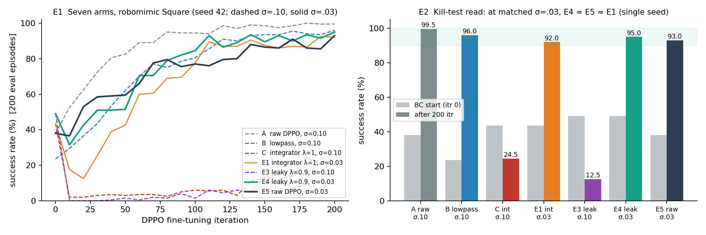
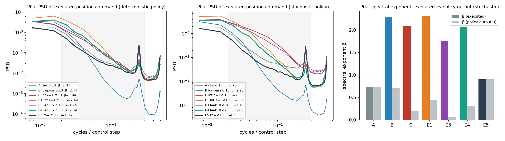
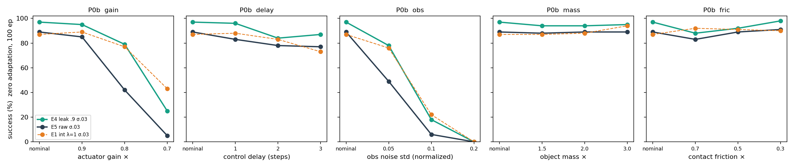
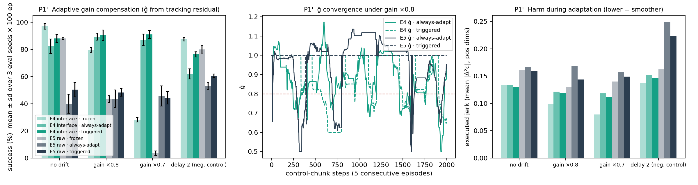
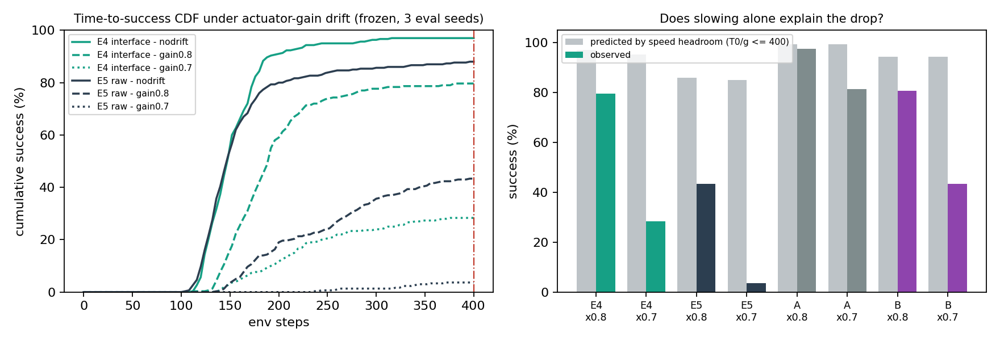
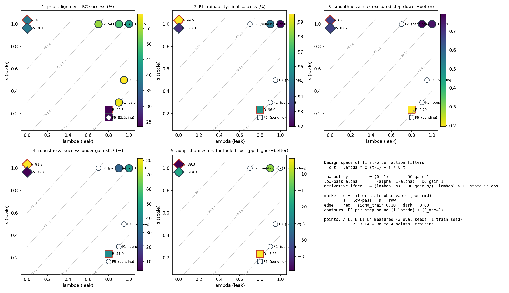
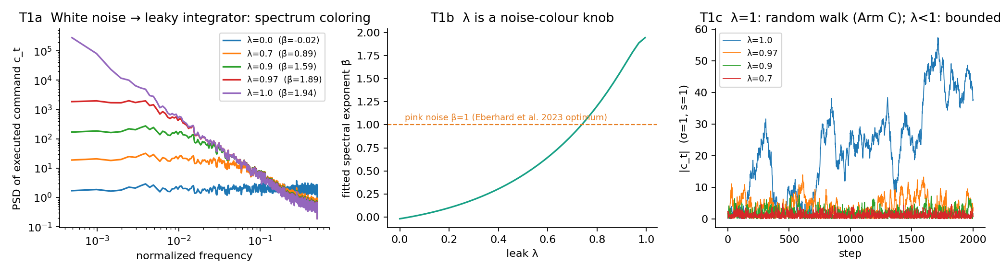
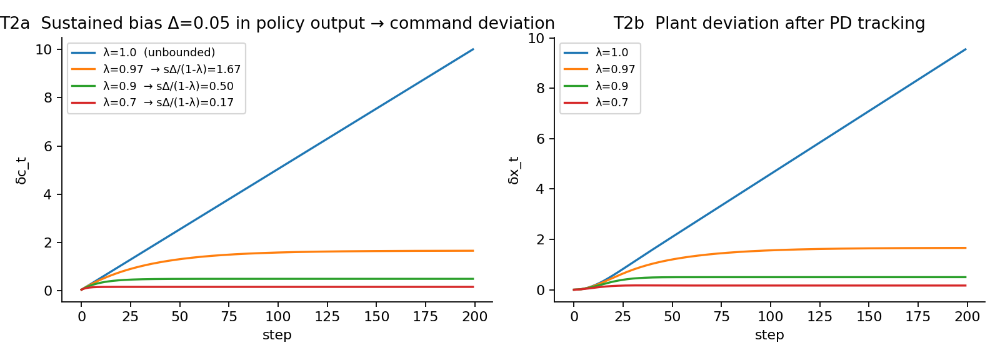

> **版本说明**。本文取代 `IDEA_REPORT_20260826` 中与 RL 微调稳定性/TTT 相关的部分，保留其约束原生（第二幕）与 SNR 诊断工具的定位。依据：(i) 七臂 CADI 实验全部跑完（robomimic Square，seed 42，200 itr）；(ii) `awesome_robo_ttt` 88 篇文献的系统解读。全文数字均可在 §1 表格或仓库 `notes/` 中找到出处；单 seed 的数字一律标注。

---

## 0. 一页摘要

**发生了什么**。8/26 方案的先导实验是「滤波器等价性杀死测试」：如果导数动作接口（CADI）的收益能被一个匹配带宽的低通滤波器复现，接口主张即死。七臂实验给出的答案是——**在匹配探索噪声预算（σ=0.03）下，泄漏接口 E4 = 95.0%、原版 DPPO E5 = 93.0%、纯积分接口 E1 = 92.0%，差异在单 seed 噪声内**；而未匹配预算时接口崩溃（C 24.5%、E3 12.5%）、原版不崩（A 99.5%）。按预注册判据，「接口提升 RL 微调成功率」的主张在准静态任务上**不成立**；被单变量证实的是一条机理：**积分型接口把上游白噪声染成红噪声（β→2），方差随时间线性增长，直到泄漏（λ<1）或降噪把它拉回**。

**这意味着什么**。接口不是性能助推器，而是一个**可控的扰动整形器**：它对任何上游扰动——RL 探索噪声、或部署期 TTT 的梯度更新——都施加同一个闭式变换，参数 λ 是唯一旋钮。这个属性对 RL 微调（上游扰动可以直接调 σ 抵消）价值有限，但对**部署期适应**正好命中三个死穴：TTT 的更新扰动不可预先调节（崩溃）、必须在闭环里实时发生（延迟）、且改权重的后果需要可证的界（安全）。

**v2 主张**。分层动作接口（冻结生成先验 → 可适应低维接口 → 泄漏积分 + 低层跟踪）是部署期适应的**结构性安全壳**：
(a) 它给出 TTT 更新扰动到执行行为的**闭式传播界**（命题 P2/P3：执行空间的隐式信任域，与上游参数改动量无关）；
(b) 它天然产出**任务耦合的自监督信号**（命题 P4：跟踪残差 = 在线动力学一致性），解决 TTT 目标错配；
(c) 它让权重级 TTT 与免权重路线（DSRL、best-of-N）共享同一低维接口，首次可在同一系统内公平对比。
评测重心从「名义成功率」转向**适应中的伤害**（瞬态偏差、约束违反、jerk、长流稳定性）与**恢复速度**——这正是文献缺口（Category 4 无反应式闭环权重级 TTT 先例；无人给出扰动传播界）。

**P0 免费实验已完成（§1.5）**：P1 在真实策略上成立（接口把执行谱指数从 ≈1 抬到 ≈2.1–2.5）；零适应漂移基线上接口相对**匹配预算的原版孪生**显示清晰收益——执行器增益 ×0.8 时 79% vs 42%，观测噪声 σ=0.05 时 78% vs 49%，且执行 jerk 在噪声下保持不变。对 P3 的修正：执行空间信任域需 s<1 才实质收紧。

**P1' 首个适应实验已完成（§1.6，3 seed）**：残差驱动的接口增益适应把增益 ×0.7 下的成功率从 28.3% 回到 **91.0%**（触发式），而施加完全相同补偿的匹配原版只从 3.7% 到 44.3%，且它在无漂移时被误适应打到 40.0%（接口 82.3%）。H1/H2 获支持，K1/K2 不触发；触发式适应从可选升为必需。

**09-05 机理复核与强对照改写了结论（§1.7–1.8）**。三件事：(i) 「积分作用抵消增益漂移」（原 H7）被补偿比检验**推翻**——两臂的执行幅度都按 g 等比缩小、策略输出不变。(ii) 对照臂 A（原版、σ=0.10）在增益 ×0.7 下 **81.3%**，是所有臂里最稳健的（接口 28.3%）：训练噪声水平的效应远大于接口效应，而 P1 的噪声放大恰恰把接口锁在低噪声 regime。(iii) **A 自己就能用残差补偿**（×0.7：81→99%，误适应代价 −0.3 pp），P1' 的「原版用不起补偿」是 E5 脆弱所致，**撤回**。

**当晚的后续实验又杀掉了「伤害上界」的强形式（§1.8g–h、§1.9）**：在**相同**的错误补偿因子下（×1.4/×1.6，3 seed），A 的成功率最稳（88/67）、E4 与低通 B 几乎重合（68/33 vs 71/39）；此前 E4「反超」是因为延迟把 A 的估计器骗得更狠。接口唯一稳定赢过所有对照的是 jerk **增幅**（谱整形），而普通一阶低通的绝对 jerk 比它低 4 倍——泄漏积分器与低通本是同一族滤波器。§1.9 给出十维度的总账与三条路线。

**决定（09-06 01:00）：路线 A**——把工作重构为一阶动作滤波器 $(\lambda,s)$ 设计空间的受控实证图（§1.10）。四个新训练点（F1 (0.9,0.3)、F2 (0.7,1.0)、F3 (0.95,0.5)、F4 = 低通 B 的 σ=0.03 孪生）已于 01:32 启动，与 5 训练 seed 复现并行；论文骨架（§6）已按此重写。

**证伪条件**（§5.5）：若 TTT-on-interface 在动力学漂移上不优于零适应 ≥10 pp，信号主张死；若 TTT-on-raw 的瞬态伤害不高于 TTT-on-interface，结构性安全主张死；若 DSRL 同预算全面持平，权重级 TTT 主张降级。三条判据在实验前写死。

---

## 1. 证据现状：七臂实验与 kill test 裁决

### 1.1 结果总表（robomimic Square，DPPO 微调 200 itr，每 10 itr 评 200 episodes，seed 42）

| 臂 | 接口 | 探索噪声 σ | BC 起点 | 终值 | 读法 |
|---|---|---|---|---|---|
| A | 原版 DPPO（位置域） | 0.10 | 38.0% | **99.5%** | 锚点：此任务上原版不崩 |
| B | 位置域 + 输出低通 | 0.10 | 23.5% | 96.0% | 零假设：滤波本身略伤先验、不伤微调 |
| C | 纯积分 λ=1 + obs_cmd | 0.10 | 43.5% | 24.5% | **崩溃**（噪声积成随机游走） |
| E1 | 同 C | **0.03** | 43.5% | 92.0% | 单变量证实：降噪即恢复 |
| E3 | 泄漏 λ=0.9 | 0.10 | **49.0%** | 12.5% | 泄漏单独不够（先验最好、可训性最差） |
| E4 | 泄漏 λ=0.9 | **0.03** | 49.0% | **95.0%** | 结构 + 预算 |
| E5 | 原版 DPPO | **0.03** | 38.0% | 93.0% | 公平对照：只降噪 |

### 1.2 被证实的机理（三条）

1. **积分接口放大探索噪声**：C→E1 单变量（只改 σ）从 24.5% 到 92.0%；A→E5 同样改动只从 99.5% 到 93.0%。接口对噪声预算的敏感度远高于原版——与命题 P1 的方差公式 $\mathrm{Var}[c_t]\to s^2\sigma^2 t$（λ=1）一致。
2. **泄漏改善先验、恶化可训性**：E3/E4 的 BC 起点 49.0% 是七臂最高，但 σ=0.1 下 E3 崩得比 C 更彻底（12.5%）。先验质量与 RL 可训性是两个独立维度——泄漏把有效上下文变短，同一 σ 下等效探索更「碎」。
3. **积分器状态必须可观测**：无 obs_cmd 时导数 DP 先验 0%（cmd 不可辨识，POMDP）；加入后恢复到 43.5%。同理，导数标签必须闭环重标注而非开环差分。

### 1.3 被否定的主张（一条）

> 「导数域接口在机理上修复位置域 DP + on-policy RL 的崩溃」——**在 Square 上不成立**：原版 DPPO 根本不崩（99.5%），接口在匹配预算下也无优势（95.0 vs 93.0，单 seed）。8/26 判据「C≤B ⇒ 接口就是个滤波器」触发。

### 1.4 未决问题（两条，转入 v2 实验）

- 接口在**需要平滑/约束的任务**（液体、易碎接触、驾驶舒适）上的价值未测——那里的指标不是成功率而是违规/jerk，白噪探索本身就是伤害。
- 接口在**部署期适应**中的价值未测——那里的扰动源不是可调的 σ 而是不可预调的梯度更新。**v2 以第二条为主线。**

### 1.5 P0 免费实验结果（2026-09-02，已完成）

用七臂的 `state_200.pt` 直接 rollout（每格 100 episodes，评测 seed 与训练评测不同），不做任何适应。脚本 `p0/rollout_record.py` + `DriftWrapper`（`make_figures.py` 同目录 `analyze_p0.py`）。

**P0a · 执行动作频谱（P1 在真实策略上成立）**

| 臂 | 成功率(det/stoch) | β̂ 执行 (det/stoch) | β̂ 策略输出 | 平均 jerk (stoch) | 最大单步变化 (stoch) |
|---|---|---|---|---|---|
| A raw σ.10 | 100 / 97 | 1.04 / 0.73 | 1.04 / 0.73 | 0.277 | 0.899 |
| B lowpass σ.10 | 97 / 92 | 2.44 / 2.28 | 0.86 / 0.70 | **0.041** | **0.190** |
| E1 int λ=1 σ.03 | 87 / 74 | 2.49 / 2.30 | 0.59 / 0.44 | 0.136 | 0.793 |
| E4 leak .9 σ.03 | 97 / 87 | 2.09 / 2.06 | 0.32 / 0.31 | 0.137 | 0.795 |
| E5 raw σ.03 | 89 / 84 | 1.06 / 0.90 | 1.06 / 0.90 | 0.181 | 0.774 |

读法：(i) 原版 DPPO 的执行谱天然接近粉噪（β̂≈1）；(ii) 接口臂的执行谱被抬到 β̂≈2.1–2.5（红），而其策略输出反而更白（0.3–0.6）——**执行 = 积分后的策略输出**，P1 的谱整形在学到的策略上定量成立（Δβ̂≈+1.7）；(iii) 接口臂的 jerk 比匹配预算的原版低约 25%（0.137 vs 0.181），但**最大单步变化并不更小**（0.795 vs 0.774）——因为 s=1.0 时 P3 的界 (1−λ)C_max+s≈1.1 并不比原版的 2 紧多少。**对 P3 的修正**：执行空间信任域只有在 s<1 时才实质收紧，s 是安全余量的第二旋钮，须与 BC 先验对齐（§1.2 第 3 条的 scale 教训）联合设计。(iv) 所有臂在 0.25 cyc/step 有尖峰 = 动作块周期（act_steps=4）的重规划不连续，接口臂该峰相对更低。

**P0b · 零适应漂移基线（首次看到接口的清晰收益）**

| 漂移 | 强度 | E4 leak | E5 raw | E1 int | E4−E5 | jerk E4 / E5 |
|---|---|---|---|---|---|---|
| 无漂移 | — | 97 | 89 | 87 | +8 | 0.129 / 0.161 |
| 执行器增益 × | 0.9 / 0.8 / 0.7 | 95 / 79 / 25 | 85 / 42 / 5 | 89 / 77 / 43 | +10 / **+37** / +20 | 0.100 / 0.140 (×0.8) |
| 控制延迟（步） | 1 / 2 / 3 | 96 / 84 / 87 | 83 / 78 / 77 | 88 / 83 / 73 | +13 / +6 / +10 | 0.132 / 0.162 |
| 观测噪声 σ | 0.05 / 0.1 / 0.2 | 78 / 18 / 0 | 49 / 6 / 0 | 76 / 22 / 0 | **+29** / +12 / 0 | 0.139 / **0.210→0.417** |
| 物体质量 × | 1.5 / 2 / 3 | 94 / 94 / 95 | 88 / 89 / 89 | 87 / 88 / 94 | +6 / +5 / +6 | 0.132 / 0.166 |
| 接触摩擦 × | 0.7 / 0.5 / 0.3 | 88 / 92 / 98 | 83 / 89 / 91 | 92 / 91 / 90 | +5 / +3 / +7 | 0.132 / 0.166 |

读法：
- **执行器增益漂移**下接口相对匹配预算的原版孪生优势最大：×0.8 时 +37 pp，×0.7 时原版几乎归零而接口仍有 25%；**纯积分 E1 同样稳健**（77% / 43%）。~~经典控制的解释是积分作用抵消乘性执行误差~~ —— **该解释已被 §1.8(b) 的补偿比检验推翻**（接口的执行幅度同样按 g 缩小、策略输出不变）；而且 §1.8(d) 显示 σ=0.10 训练的原版 A 在 ×0.7 下达 81.3%，远高于接口。当前最简约的解释是接口臂训练期的等效执行噪声更大（见 H7'）。
- **观测噪声**：σ=0.05 时 +29 pp；执行 jerk 上接口维持 0.139 不变，原版从 0.21 涨到 0.42——这是 P1「接口滤掉上游噪声」在真实策略上的直接体现，也是 §5.3「适应伤害」指标要抓的现象。
- **延迟** +6~+13；**质量/摩擦**两臂都稳健（Square 的方形螺母质量对任务影响小），差异在噪声内。
- **注意**：单训练 seed；本次评测无漂移时 E4 已领先 8 pp，但增益与观测噪声下的差距（+37/+29）远超该基线差；E1 的同步稳健性是独立于 E4 的第二个证据点。K0（先验对齐）与 K2（结构性伤害）的预判：**均倾向不触发**。

**P0 对方案的影响**：(1) 主线不变，但「结构性安全壳」从纯理论主张升级为有初步经验支撑的主张；(2) 漂移套件里执行器增益与观测噪声应作为主战场，质量/摩擦降为次要；(3) 把「s 的选择」写进 P3 的设计方程；(4) 5 seeds 复现列为 P2 的第一项（09-05 起在跑：seed 43–46 的 E4/E5 微调链）。**09-05 追加**：本节的接口 vs 原版比较全部是「匹配预算孪生」比较；部署相关的排名见 §1.8(d)，原版 A（σ=0.10）在增益漂移下强于接口。

### 1.6 P1' 首个适应实验：残差驱动的接口增益适应（2026-09-02，已完成，3 评测 seed × 100 episodes）

**设置**。TTT-I 的最小实例（参数级，Neural-Fly 式）：用无漂移 rollout 校准名义映射 $\hat K$（执行指令 → 末端位移，逐臂校准），部署期在自由运动步（夹爪张开、|指令|>0.15）上用滑窗最小二乘估计增益比 $\hat g_t$，执行指令按 $1/\hat g_t$ 补偿。三种模式：**冻结**（不适应）/ **常开**（始终补偿）/ **触发式**（死区 |ĝ−1|>0.15 且 >2·SE 才启动、<0.08 关闭，窗口 120，裁剪 [0.6,1.5]）。**公平对照**：原版 E5 施加完全相同的输出补偿 $u/\hat g_t$。漂移：增益 ×0.8/×0.7；延迟 2 步作**负控制**（残差法不应对延迟有效）。脚本 `adaptive_gain.py` + `run_p1_batch.sh` / `run_p1_trig.sh`，分析 `analyze_p1.py`。

| 臂 | 模式 | 无漂移 | 增益 ×0.8 | 增益 ×0.7 | 延迟 2（负控制） | ĝ(×0.7) | jerk(×0.7) |
|---|---|---|---|---|---|---|---|
| **接口 E4** | 冻结 | 97.0±2.2 | 79.7±1.9 | 28.3±1.7 | 87.3±1.2 | — | 0.080 |
| | 常开适应 | 82.3±5.2 | 89.3±2.5 | 87.0±4.3 | 62.0±3.7 | 0.662 | 0.118 |
| | **触发式** | 88.0±2.9 | **90.3±3.9** | **91.0±2.9** | 76.3±1.9 | 0.674 | 0.112 |
| **原版 E5** | 冻结 | 88.0±0.8 | 43.3±2.5 | 3.7±1.7 | 80.0±2.8 | — | 0.140 |
| | 常开适应 | 40.0±7.0 | 43.7±6.5 | 45.7±7.4 | 53.0±2.4 | 0.700 | 0.158 |
| | 触发式 | 50.3±5.3 | 48.3±2.9 | 44.3±4.5 | 60.7±1.2 | 0.743 | 0.149 |

**四条读法**：

1. **适应在接口上有效、在原版上失效**。增益 ×0.7 下接口从 28.3% 回到 91.0%（回收了 68.7 个失分点中的 62.7 个，91%），原版只从 3.7% 到 44.3%（回收 48%）——而两臂的 ĝ 估计一样准（0.67 vs 0.74，真值 0.70）。**同一个补偿信号，接口能用、原版用不起**。
2. **现象 = 对增益误差的双向耐受**。ĝ 的估计噪声本身就是一个随机方向的乘性增益误差。匹配原版 E5 对任意方向的增益误差都脆弱（P0b：×0.8 即掉到 43%），所以常开适应在无漂移时把它打到 40.0（−48）；接口同样的误适应只掉到 82.3（−15）。~~接口靠积分作用两向耐受~~——机理解释已在 §1.8(b) 撤回；**耐受性本身是否为接口所独有，取决于对强原版 A 的同规则实验（§1.8 后果 2，在跑）**。若 A 同样耐受，这条读法降为「低噪声训练的策略脆弱」，与接口无关。
3. **残差信号在接口上更可辨识**。原版指令更白，单步残差相关性更低（校准相关 0.70 vs 0.82），ĝ 的 sd 0.32 vs 0.20——接口不仅耐受误差，还产生更干净的信号（P4 的一个具体表现：可辨识性依赖指令的时间相关性）。
4. **触发式减轻但未消除误适应**：接口无漂移 82.3 → 88.0（冻结 97.0），延迟 62.0 → 76.3（冻结 87.3）。负控制暴露了残差法的**专一性缺口**——延迟被误读为增益（ĝ≈0.77–0.85）——需要 §3.3 的第二路信号或延迟感知的估计器；这正是 Sentinel「一种度量抓不到所有失败」的实例。

**对预注册判据的读数**：H1（适应收益 ≥10 pp）在接口上成立（+10.6 / +62.7）；H2（接口伤害更低）**相对匹配孪生 E5** 成立（误适应伤害 −15 vs −48，jerk 全部条件更低），相对强原版 A 待验证（§1.8）；**K1 不触发，K2 暂不触发**（以 A 的结果为准）。K3（DSRL 对照）与 5 训练 seed 复现仍待 P2。

**对方案的影响**：(1) §3.2 的 TTT-I 分为**参数级**（本节，已验证）与**神经头级**（待做）两档，参数级作为默认第一层；(2) §3.4 的触发器从「可选」升为**必需**，且需双信号；(3) 新增伤害指标「误适应代价」= 无漂移下适应开/关的成功率差，写入 §5.3；(4) 延迟类漂移需要专门的信号设计，列入 P2。

### 1.7 P1'' 延迟感知估计器（2026-09-05，v1 中期结果 + v2 在跑）

**动机（来自 §1.6 负控制）**。纯残差增益法在延迟 2 步时把接口成功率从 87.3% 打到 62.0%（常开）/ 76.3%（触发），因为 $\hat g$ 把时序错位误读成乘性增益不足（ĝ≈0.77–0.85）。H4 的修正不能只靠第二路信号——参数级层自己就需要区分「延迟」与「增益」。

**v1 硬否决规则（`adapt=3`）**。在自由运动滑窗内对 lag $\tau\in\{0,\ldots,3\}$ 扫描对齐度 $\mathrm{corr}(K\!\cdot\! c_{t-\tau}, \Delta x_t)$ 选 $\tau^\star$；**仅当 $\tau^\star=0$** 且 $|\hat g-1|$ 过触发阈值时才补偿，$\tau^\star>0$ 一律不补偿。

**v2 对齐读数规则（`adapt=5`）**。不否决，而是**在最佳对齐 lag 上读增益**：$\hat g\leftarrow\hat g_{\tau^\star}$，lag 0 优先（其他 lag 的对齐度须高出 5% 才切换）。纯延迟下 $\hat g_{\tau^\star}\approx1$，自动落入死区不补偿；纯增益或「增益+延迟」复合漂移仍被补偿（$\hat g_{\tau^\star}\approx g$）。

**预注册预测**（3 评测 seed × 100 ep，与 P1' 同网格；对 v1 与 v2 同样适用）：

| 条件 | P1' 触发式 E4 | 预测 | 判据 |
|---|---|---|---|
| 无漂移 | 88.0 | ≥ 92（接近冻结 97） | 误适应代价 ≤ 5 pp |
| 增益 ×0.7 | 91.0 | ≥ 88（≤3 pp 损失） | 灵敏度保住（H1 仍成立） |
| 延迟 2（负控制） | 76.3 | ≥ 84（接近冻结 87.3） | 专一性修复 ≥ 8 pp |

**第一批 v1/v2 结果作废（实现 bug，09-05 20:40 发现）**。第一版代码在每个 episode 重置时清空了 lag 扫描用的 (cmd, dx) 历史，而触发器用的滑窗统计量是跨 episode 持久的；结果 delay-aware 路径在每个 episode 开头的前 40 个自由运动步里读到 $\hat g=1$、把触发器关掉——恰好是接近抓取的阶段。表面现象是「负控制修好了（89%）但 ×0.7 掉了 20 pp」，实为补偿被周期性关断（激活率 94.6% → 66.7%），与延迟判别无关。已修复（历史随触发统计量一起持久），三批重跑在进行：E4/E5 v2（24 组）、A v2（12 组）、E4 v1 硬否决参考（12 组），前缀 `p1f_`。**教训写入 §7**：任何新的估计器路径必须先在无漂移条件下与旧路径做等价性检查（激活率、ĝ 轨迹逐步对比），再进入漂移网格。

**脚本**：`run_p1_fixed.sh`（`ARMS`/`MODES` 环境变量选臂与模式）；分析 `analyze_p1_all.py`（三臂 × 五模式统一表 + lag 分布诊断）。

### 1.8 H7 机理复核：积分补偿假说被推翻，对照臂需要更换（2026-09-05）

这一节记录三项对已有数据的复核（脚本 `analyze_h7_mech.py`、`analyze_h7_timing.py`，无新实验），结论改变了 §1.5/§1.6 的机理解释和 §5.2 的对照设计。

**(a) obs_cmd 掩码消融无信息量，已停止**。部署时把 obs 尾部 3 维 integrator state 置零：E4 在无漂移、×0.8、×0.7 下全部 **0%**（6/6 组、600 episodes）。无漂移也是 0 说明掩码本身就是分布外观测、直接毁掉策略（与 §1.2 第 3 条一致），它分不开「积分结构」与「看见意图」。而 §1.2 已知无 obs_cmd 的接口臂先验为 0%、无法训练——因此 H7 的 obs_cmd 子问题**在本设定下不可检验**，从消融清单删除（11/18 组后停批）。

**(b) 补偿比检验：接口在增益漂移下并没有「积分补偿」**。若积分作用在抵消执行器衰减，接口臂的执行幅度应回到接近无漂移水平（比值 → 1），策略输出应变大。实测（冻结臂，3 评测 seed）：

| 臂 | 增益 | 执行幅度比 $R_{\text{exec}}$ | 策略输出比 | 成功率 |
|---|---|---|---|---|
| E4 接口 | ×0.8 | 0.831（g=0.8） | 0.983 | 79.7 |
| E4 接口 | ×0.7 | **0.659（g=0.7）** | **0.997** | 28.3 |
| E5 原版 | ×0.8 | 0.745 | 0.931 | 43.3 |
| E5 原版 | ×0.7 | 0.666 | 0.951 | 3.7 |

两臂的执行幅度都按 g 等比缩小、策略输出不变——**接口策略并没有对「走得慢」做出更用力的反应**。§1.5 与 §1.6 把接口的增益稳健性归于「积分作用抵消乘性执行误差」的解释**被直接推翻**；H7 作为机理假设撤回。接口相对匹配预算的原版孪生 E5 的优势（+36 / +25 pp，3 seed）是**真实但未解释的现象**。

**(c) 速度余量也不是原因，失败发生在精度阶段**。无漂移的完成时间 E4 T50/T90 = 148/184 步、E5 = 144/192 步；若只是慢 30%，400 步上限内应有 95% / 85% 成功，实测 28% / 4%。增益 ×0.7 下 E5 在 **38%** 的 episode 里从未闭合夹爪（E4：3.7%），首次抓取从 68 步推迟到 166 步；E4 能抓取但插入失败。增益漂移破坏的是抓取对准与插入这两个精度阶段。

**(d) 对照臂改写了部署相关的排名**。原版 A（σ=0.10）与低通 B（σ=0.10）的冻结漂移基线（3 评测 seed，`ctrl_*`）：

| 臂 | 训练探索 σ | 无漂移 | 增益 ×0.8 | 增益 ×0.7 | 延迟 2 |
|---|---|---|---|---|---|
| **A 原版** | 0.10 | 99.3 | **97.7** | **81.3** | 91.0 |
| B 原版 + 低通 | 0.10 | 95.3 | 80.7 | 43.5 | 88.0 |
| E4 接口 λ=0.9 | 0.03 | 97.0 | 79.7 | 28.3 | 87.3 |
| E5 原版 | 0.03 | 88.0 | 43.3 | 3.7 | 80.0 |

**用更大探索噪声训练的原版 DPPO 是增益漂移下最稳健的臂，而且差距很大**。把训练噪声从 0.03 提到 0.10（E5→A）带来 +54 / +78 pp；加接口（E5→E4）带来 +36 / +25 pp。更糟的是两者不独立：P1 的噪声放大意味着接口**只能**在低 σ 下训练（σ=0.10 的 C/E3 崩溃），于是接口间接把策略锁进了不稳健的低噪声 regime。在 Square 上，「想要增益稳健性，用 σ=0.10 训原版」严格优于「用接口」。

**(e) P1'-on-A：强原版能用补偿，「接口让补偿可用」的主张死；接口剩下的是「适应出错时的伤害上界」**（09-05，A 臂 K 自校准 = (0.01299, 0.02029, 0.02155)，触发式 2 评测 seed、常开 1 seed，其余在跑）：

| 臂 | 模式 | 无漂移 | 增益 ×0.7 | 延迟 2（估计器被骗） | jerk 延迟 2 / 冻结 |
|---|---|---|---|---|---|
| **A 原版 σ=0.10** | 冻结 | 99.3 | 81.3 | 91.0 | 0.188 |
| | 触发式 | 99.0（−0.3） | **99.0（+17.7）** | **54.0（−37.0）** | 0.369（**×1.96**） |
| | 常开 | 99.0（−0.3） | 97.0（+15.7） | 49.0（−42.0） | 0.455（×2.42） |
| **E4 接口** | 冻结 | 97.0 | 28.3 | 87.3 | 0.137 |
| | 触发式 | 88.0（−9.0） | 91.0（+62.7） | **76.3（−11.0）** | 0.147（**×1.07**） |
| | 常开 | 82.3（−14.7） | 87.0（+58.7） | 62.0（−25.3） | 0.152（×1.11） |

三条读法：
1. **§1.8 后果 2 的预注册死亡条件触发**：A 在触发式补偿下 ×0.7 达 99%（≥95）、无漂移误适应代价 −0.3 pp（≤5）。E5 用不起补偿是因为它是脆弱的低噪声策略，不是因为它缺接口。§1.6 读法 1「同一个补偿信号，接口能用、原版用不起」**撤回**；读法 2 的「双向耐受」在**增益方向**上不是接口独有（A 的 ĝ 同样在 0.93–0.99 间抖动却无代价）。
2. **唯一让 E4 反超 A 的条件是估计器被骗的负控制**。延迟 2 步下残差法把 ĝ 误估为 0.63–0.65（A）/ 0.80（E4），两臂都被喂了错误的 1/ĝ 补偿：A 的成功率掉 37–42 pp、jerk 翻倍；E4 掉 11–25 pp、jerk 几乎不变。A 在其他所有条件（无漂移、增益、以及 P0b 的全部漂移）都强于 E4，**只在这里输**——而且是绝对成功率上输（54 vs 76，49 vs 62）。这正是 v2 的核心主张（结构性安全壳：上游更新出错时执行伤害有界，P2/P3），第一次在**强对照**下得到支持；也正是 H2 的形态：不是「接口更好」，而是「接口更不容易被搞坏」。
3. **它改写了论文的卖点**。接口不买性能（§1.3）、不买鲁棒性（§1.8d）、不买可适应性（本节）；它买的是**错误适应的伤害上界**——成功率损失小 3 倍、jerk 增幅小 10 倍以上。相应地，评测协议必须把「估计器被骗」作为标准条件（不是负控制而是主指标），并把 jerk 增幅与最坏 episode 偏差与 P2 的界并列。候选机制（待 P2 分辨）：导数域里错误增益只改变执行**速度**、不改变 4 步动作块内的**轨迹形状**，再规划时的修正是对 $c_t$ 的平缓改动；位置增量域里 1/ĝ 误差让每个动作块超调 50% 并在再规划时反向修正，形成块频率上的极限环（P0a 的 0.25 cyc/step 尖峰、jerk ×2）。
4. **这条存活主张自己也要过一次滤波器等价性 kill test**（在跑，`run_p1_armB.sh`）：低通臂 B 与 A 同训练配方（σ=0.10），只多一个执行侧一阶滤波。预注册：若 B 在「估计器被骗」下的成功率损失与 jerk 增幅落在 E4 一侧（≤ −20 pp、jerk ≤ ×1.3），则伤害上界归于**任何执行侧线性平滑**，论文主张再降一档为「执行侧平滑结构对误适应的保护」（仍可发，但导数参数化不再是卖点）；若 B 落在 A 一侧，导数参数化 + 可观测积分状态才是关键，主张保留。

**(f) 一个迟到的概念修正：P1' 的补偿装在了接口的下游，从未测试过结构主张**。P1' 及本节 (e) 的所有参数级适应都把 $1/\hat g$ 乘在**执行指令** $c_t$ 上（`AdaptiveGainWrapper` 位于 `derivative_action` 之下），即积分器的**下游**。P2/P3 的界只对积分器**上游**的扰动成立——下游扰动直达执行器，接口按定义不提供任何保护。所以到目前为止的参数级实验测的是**策略本身对执行增益误差的闭环鲁棒性**（于是训练噪声水平主导、A 最强），而不是接口结构。对原版臂上下游是同一处，对接口臂则不是。

正确的接口级适应应把 $1/\hat g$ 乘在导数输出 $u_t$ 上（上游）。对静态增益误差，线性系统上下游等价（$c_{ss}$ 同样按 $1/\hat g$ 放缩）；差别出在**时变**误差——真实估计器的 $\hat g_t$ 抖动。乘性噪声正比于注入点的信号幅度：上游是 $s\,u_t$，下游是 $c_t\approx s\,u/(1-\lambda)$，相差约 $1/(1-\lambda)=10$ 倍；上游白噪声经泄漏积分方差放大 $1/(1-\lambda^2)\approx5.3$ 倍后，**执行端方差仍比下游注入小约 20 倍**，且谱被染红（jerk 低）。这是「adapt upstream, execute smoothly」的精确形式，也是接口特有的：低通臂 B 的滤波器 DC 增益为 1，只有白噪声方差衰减 $(1-\alpha)/(1+\alpha)\approx0.11$，没有幅度比的红利。

两组实验（已实现、排队中）：
- **受控适应噪声**（`run_compnoise.sh`，`CompNoiseWrapper`）：冻结策略、无漂移，位置维乘 $(1+\varepsilon_t)$、$\varepsilon_t\sim\mathcal N(0,\sigma_\varepsilon)$ 逐步独立，$\sigma_\varepsilon\in\{0.25,0.5\}$，E4/B 各做上游与下游两种注入点，A 一种；3 seed。
- **上游补偿的 P1'**（`run_p1_upstream.sh`，`UpstreamCompWrapper`，`--adapt-where up`）：估计仍在下游（执行指令 vs 位移，无偏），补偿乘在 $u_t$；E4/B × 常开/触发 × {无漂移、增益 ×0.7、延迟 2（估计器被骗）} × 3 seed。

**预注册**：(i) E4-up 在 $\sigma_\varepsilon=0.5$ 下的成功率损失 ≤ E4-down 的 1/3、jerk 倍数 ≤ 1.2，而 E4-down ≈ A（结构对下游无保护）；(ii) B-up 优于 B-down 但弱于 E4-up；(iii) 上游补偿下 E4 在「估计器被骗」条件的损失显著小于 (e) 中的下游补偿（−11/−25 pp）。**Kill**：E4-up ≈ E4-down → P2 对适应噪声没有经验效力，结构主张彻底死亡；E4-up ≈ B-up → 保护是通用滤波，导数参数化不是卖点。

**受控适应噪声读数（3 评测 seed × 100 ep，冻结、无漂移）**：

| 配置 | σ_ε | 成功率（Δ vs 无漂移） | jerk（倍数） | 最大单步变化（倍数） |
|---|---|---|---|---|
| A 原版 | 0.25 / 0.5 | 98.3 (−1.0) / 98.0 (−1.3) | 0.195 (×1.12) / 0.239 (×1.37) | 0.78 (×1.14) / 1.11 (×1.63) |
| E4 下游 | 0.25 / 0.5 | 94.3 (−2.7) / 93.0 (−4.0) | 0.195 (×1.46) / 0.282 (×2.12) | 0.88 (×1.12) / 1.20 (×1.52) |
| **E4 上游** | 0.25 / 0.5 | 91.7 (−5.3) / 91.0 (−6.0) | 0.136 (**×1.02**) / 0.140 (**×1.05**) | 0.86 (×1.09) / 0.94 (×1.20) |
| B 下游 | 0.25 / 0.5 | 95.3 (0) / 94.3 (−1.0) | 0.103 (×3.33) / 0.189 (×6.11) | 0.59 (×3.0) / 1.07 (×5.5) |
| **B 上游** | 0.25 / 0.5 | 95.7 (+0.3) / 92.0 (−3.3) | 0.035 (×1.14) / **0.043** (×1.40) | 0.20 (×1.01) / **0.22** (×1.13) |

三条读法：(1) **P1/P2 对平滑度有经验效力**：上游注入的白噪声被滤平——E4 jerk 倍数 1.05 vs 下游 2.12，B 1.40 vs 6.11；E4-up 的相对增幅最小，(f) 的幅度比红利成立（预注册 ii 通过）。(2) **对成功率没有**：零均值白噪声在 σ_ε=0.5 下几乎不伤任何臂（A −1.3、B −3.3/−1.0、E4 −6.0/−4.0）；伤成功率的是**偏差**（(g) 的静态错误增益），而对偏差上下游等价。预注册 (i) 的成功率部分不成立（E4-up 甚至比 E4-down 差 2 pp，在噪声内），且 E4 仍是对噪声最敏感的强臂。(3) **P3 的量上低通完胜**：B-up 的最大单步变化绝对值 0.22，是 E4-up（0.94）的 1/4——低通 α=0.8 的结构界 2(1−α)=0.4，接口 s=1 的界 (1−λ)C_max+s=1.1（P0a 已指出）。**接口选 s=1 是为了 BC 先验对齐（§1.2 的 scale 教训），代价恰恰是安全壳的松紧**；把 s 调小等价于向 B 靠拢——这正是路线 A 的 F1 点 (0.9, 0.3) 要量的东西。

**上游补偿的 P1'（第一批作废，重跑中）**。第一批 `p1u_*`（36 组）显示上游补偿对增益漂移**无效**（E4-up ×0.7：19–23%，冻结 28%；B-up：41–45%，冻结 41%），而下游补偿有效（87–97%）。诊断（执行幅度比：下游恢复到冻结的 0.92–1.01，上游只到 0.83–0.86；策略输出幅度与 ĝ 正常、无饱和）指向两个原因：(i) **实现缺陷**——`UpstreamCompWrapper` 只缩放了位置 3 维，而漂移与下游补偿作用于全部 6 个非夹爪维，旋转增益未补偿 → 抓取对准失败；已修复，重跑为 `p1v_*`。(ii) **一个真实的结构效应，待重跑分离**：E4 的策略通过 obs_cmd 观测积分器状态 $c_{t-1}$，它调节的是 $c$ 而不是 $u$——上游对 $u$ 的缩放在下一个决策点就被策略当作偏差纠正回去（E4-up 的 $|u|$ 与冻结持平、$|c|$ 只涨 13% 而非 47%）。若重跑后 B-up 有效而 E4-up 仍无效，则结论是：**让滤波器状态可观测是先验可辨识的必要条件（§1.2），但它同时使接口参数无法从上游适应**——P2 保护与可适应性在这一设计上互斥。这会成为设计空间图的一个轴。

**重跑（`p1v_*`，全部 6 维缩放，3 评测 seed × 100 ep）证实了 (ii)**：

| 臂 | 补偿位置 | 无漂移 | 增益 ×0.7 | 延迟 2（被骗） | jerk 倍数 ×0.7 |
|---|---|---|---|---|---|
| B 低通（状态不可观测） | 冻结 | 95.3 | 41.0 | 87.0 | — |
| | 下游（常开 / 触发） | 91.3 / 92.7 | 94.0 / 96.7 | 71.7 / 81.7 | 1.44 / 1.39 |
| | **上游（常开 / 触发）** | 90.7 / 96.0 | **92.3 / 93.0** | 72.0 / 74.3 | 1.40 / 1.35 |
| E4 积分（状态可观测） | 冻结 | 97.0 | 28.3 | 87.3 | — |
| | 下游（常开 / 触发） | 82.3 / 88.0 | 87.0 / 91.0 | 62.0 / 76.3 | 1.48 / 1.40 |
| | **上游（常开 / 触发）** | 88.7 / 92.7 | **26.7 / 36.3** | 63.7 / 80.3 | **2.28 / 1.73** |

低通的上游补偿与下游等效（92–93 vs 94–97）；积分接口的上游补偿几乎无效（27–36 vs 下游 87–91），**且 jerk 更差**（×1.7–2.3 vs ×1.4）——策略与上游缩放互相拉扯产生抖动，「adapt upstream, execute smoothly」对状态可观测的接口是双重错误。机制如 (ii) 所述：E4 的策略以 $c_{t-1}$ 为观测、以 $c$ 为被控量，上游改 $s_{\text{eff}}$ 只是改了它的执行器增益，它在下一个决策点就补回来。**推论**：对状态可观测的接口，「接口级参数适应」只能装在下游，而下游没有 P2 保护——§3.2(a) 与 §1.8f 开头设想的「上游适应享受 P2 界」在这类接口上不可实现。反过来，状态不可观测的低通（B）既能上游适应又享受 P2 的 jerk 平滑（B-up σ_ε=0.5：jerk ×1.40 vs 下游 ×6.11），却在 §1.2 的意义上不能作为「导数」接口训练先验。这条互斥关系是设计空间图上「状态可观测」这一离散维度的主要内容。

**(g) 受控静态错误补偿：(e) 的强形式也死了**（`run_overgain.sh`，冻结策略、执行增益 ×0.7…×1.6，全部 3 评测 seed）：

| 臂 | ×0.7 | ×0.8 | ×1.0 | ×1.2 | ×1.4 | ×1.6 | jerk 倍数 ×1.4 / ×1.6 |
|---|---|---|---|---|---|---|---|
| **A 原版 σ=0.10** | 81.3 | 97.7 | 99.3 | 95.3 | **88.0** | **67.0** | 1.60 / 2.28 |
| B 原版+低通 | 41.0 | 80.7 | 95.3 | 88.0 | 70.7 | 39.3 | 1.67 / 2.03 |
| E4 接口 | 28.3 | 79.7 | 97.0 | 91.0 | 68.0 | 33.3 | **1.21 / 1.27** |
| E5 原版 σ=0.03 | 3.7 | 43.3 | 88.0 | 64.7 | 35.0 | 12.7 | 1.81 / 2.33 |

在**相同**的错误补偿因子下，A 的成功率两个方向都最稳，E4 与 B 在过补偿侧几乎重合（×1.4：68 vs 71；×1.6：33 vs 39），欠补偿侧 E4 更差（×0.7：28 vs 41）。(e) 里 E4「反超」A，是因为延迟把 A 的估计器骗得更狠（ĝ 0.63 → 施加 ×1.55）而 E4 只被骗到 ĝ 0.80–0.88（×1.14–1.25）——**是估计器被骗的程度不同，不是结构保护**。(e) 的读法 2/3 撤回。接口在这张表上唯一稳定的优势是 **jerk 增幅**（×1.31 vs A ×2.09、B ×1.69），但 B 的绝对 jerk 在每个格子都比 E4 低约 4 倍。

**(h) 修复后的延迟感知估计器（3 seed E4；A 2–3 seed）**：v1 硬否决——无漂移 92.0（代价 −5）、×0.7 86.0（灵敏度 −5 pp）、延迟 80.5（代价 −6.8，触发式 −11）：专一性略升、灵敏度略降，三条预注册阈值只过一条（无漂移）。v2 对齐读数——对 E4 **无效**（延迟下 $\hat g_{\tau^\star}=0.87$ 而非 ≈1，代价 −13.8 与触发式持平）；对 A **非常有效**（代价 −39.3 → −5.5，成功率 95）。原因是命令谱：原版的白噪声指令让 lag 结构干净、对齐后 $\hat g\to1$；接口的红噪声指令让 lag-0 校准的 $K_{\text{eff}}$ 已吸收滞后响应，对齐也无法复原。**接口的平滑性损害了自监督信号的延迟可辨识性**——与 P4「接口产生更干净的信号」方向相反（增益可辨识性确实更好：校准相关 0.82 vs 0.70，但 B 更好：0.91–0.95）。

### 1.9 综合裁决（2026-09-05 深夜）：导数接口在 Square 上到底买到了什么

把 09-02 到 09-05 的全部对照放在一张表里（单训练 seed、3 评测 seed；「高/低/≈」指接口相对该对照）：

| 维度 | vs 匹配孪生 E5（σ=.03） | vs 强原版 A（σ=.10） | vs 低通 B（σ=.10） | 出处 |
|---|---|---|---|---|
| BC 先验成功率 | 高（49 vs 38） | 高（49 vs 38） | 高（49 vs 23.5） | §1.2 |
| RL 微调终值（匹配预算） | ≈（95 vs 93） | 低（95 vs 99.5） | ≈（95 vs 96） | §1.1 |
| 零适应漂移鲁棒性（增益 ×0.7） | 高（28 vs 4） | **低**（28 vs 81） | 低（28 vs 41） | §1.5/§1.8d |
| 残差补偿可用性（×0.7 触发式） | 高（91 vs 44） | **低**（91 vs 99） | 低（91 vs 98） | §1.6/§1.8e |
| 相同错误补偿下的成功率（×1.4） | 高（64 vs 45） | **低**（64 vs 93） | 低（64 vs 75） | §1.8g |
| 错误补偿下的 jerk **增幅** | 低（1.21 vs 1.78） | **低**（1.31 vs 2.09） | 低（1.21 vs 1.69） | §1.8g |
| 绝对执行 jerk（所有条件） | 低 | 低 | **高约 4×** | §1.5/§1.8 |
| 上游适应噪声（σ_ε=.5）的 jerk 增幅 | — | 低（1.05 vs 1.35） | 低（1.05 vs 1.36），但绝对值高 3× | §1.8f |
| 上游适应噪声（σ_ε=.5）的成功率 | — | 低（−5 vs −1） | 低（−5 vs +3） | §1.8f |
| 最大单步变化（P3 的量，σ_ε=.5 上游） | — | 低（0.93 vs 1.11） | **高 4×**（0.93 vs 0.21） | §1.8f |
| 残差信号：增益可辨识（校准相关） | 高（.82 vs .70） | ? | 低（vs .91–.95） | §1.6/§1.8h |
| 残差信号：延迟可辨识 | ? | **低** | 低 | §1.8h |
| 接口参数的上游可适应性（×0.7 上游补偿，3 seed） | — | — | **低**（27–36 vs 92–93，jerk ×1.7–2.3 vs ×1.4；状态可观测使策略抵消上游缩放） | §1.8f |

**三句话结论**。(1) 接口几乎全面优于它的匹配孪生 E5——因为 E5 是个被低探索噪声训坏的策略，不是因为接口；(2) 接口在**每一个成功率指标**上都输给用 σ=0.10 训练的原版 A，而接口自身的噪声放大（P1）正是它不能用 σ=0.10 训练的原因；(3) 接口唯一稳定赢过所有对照的是**扰动到执行的 jerk 增幅**（谱整形，P1），但一个普通的一阶低通在绝对 jerk 上比它好 4 倍。结构上，泄漏积分器 $c_t=\lambda c_{t-1}+s u_t$ 与低通 $e_t=\alpha e_{t-1}+(1-\alpha)u_t$ 是**同一族一阶滤波器**，差别只是 DC 增益（$s=1$ vs $s=1-\alpha$）和策略被重训成输出「增量」；P2/P3 的界对两者同样成立。「导数动作空间」这个概念在本任务上有经验支撑的独有效应只有两个：更好的 BC 先验（+11 pp）和 RL 探索噪声的谱整形——而后者是一把双刃剑。

**尚未落地的实验**（在跑，预计不改变结论方向）：适应噪声与过补偿的 seed 2–3；上游补偿的 P1'（估计器被骗条件下 E4 的成功率损失预计与下游相近、jerk 更低）；B 的常开延迟；5 训练 seed。

**路线建议**（需要你决定）：
- **路线 A（推荐）**：把这项工作写成**一阶动作滤波器 (λ, s) 设计空间的受控实证图**——「导数/速度动作空间为扩散策略买到了什么？」现有臂已是这张图上的点：A = 无滤波、B = (0.8, 0.2)、E1/C = (1, 1)、E3/E4 = (0.9, 1)；再补 4–6 个点（如 (0.9, 0.3)、(0.7, 1)、(0.95, 0.5)、B 的 σ=0.03 孪生）就能把「先验对齐 / RL 可训性 / 执行平滑 / 部署鲁棒性 / 自监督信号质量」五个轴画在同一张图上。贡献：(i) 图本身（多数论文只选一个点且不报告对照）；(ii) 一套评价动作接口主张的实验协议（匹配预算孪生 + 最强原版 + 滤波器零假设 + 直接机理测量 + 上下游注入），本方案的每一次自我修正都是协议条目；(iii) 训练探索噪声水平主导部署鲁棒性、而高 DC 增益的积分型接口结构性地压低可用噪声；(iv) 泄漏积分 ≡ 高 DC 增益低通，s 的选择在先验对齐与安全壳松紧之间的权衡（P3 的量上 B 比 E4 好 4 倍）；(v) 命令谱与残差信号可辨识性（增益 vs 延迟）的关系。新增训练约 6 × (预训练 + 微调) ≈ 6 × 20 h，与 5 seed 复现并行；3–4 周成稿；目标 CoRL / RA-L，或 ICRA workshop 先发负结果部分。
- **路线 B**：回到 CADI 第二幕（液体/易碎接触等**平滑度即约束**的任务），以违规/jerk 为主指标——但必须把低通 B 作为基线，而 B 目前在 jerk 上更好；接口要赢只能靠 BC 先验质量与约束任务上的 RL 可训性，需要新任务与新训练（≥4 周，风险高）。
- **路线 C（不推荐）**：继续 TTT 安全壳（神经头级 TTT-I）。结构界对低通同样成立，差异化已不存在；文献坐标（§2）里的空位仍在，但填空的方法不必是导数接口。

### 1.10 路线 A 执行计划（2026-09-06 01:00 锁定）

**统一记号**。所有臂都是策略输出 $u_t$ 与执行指令之间的一阶滤波器 $c_t=\lambda c_{t-1}+s\,u_t$：原版 = 无滤波；低通 α ⇔ $(\lambda,s)=(\alpha,1-\alpha)$，DC 增益 1；「导数接口」 = DC 增益 $s/(1-\lambda)>1$ 且策略重训为输出增量、滤波器状态进观测。图的横轴是 $(\lambda, s)$，第三个离散维度是训练探索噪声 σ 与滤波器状态是否可观测。

**图上的点**（`design_space/POINTS.md`；F 系列 09-06 01:32 启动，`design_space/run_point_chain.sh`）：

| 点 | λ | s | 模式 | σ_train | 状态可观测 | 状态 |
|---|---|---|---|---|---|---|
| A | — | — | 原版 | 0.10 | — | 完成 |
| E5 | — | — | 原版 | 0.03 | — | 完成（匹配预算孪生） |
| B | 0.8 | 0.2 | 低通 | 0.10 | 否 | 完成 |
| **F4** | 0.8 | 0.2 | 低通 | **0.03** | 否 | 训练中（B 的匹配预算孪生，无需预训练） |
| E1/C | 1.0 | 1.0 | 积分 | 0.03 / 0.10 | 是 | 完成 |
| E3/E4 | 0.9 | 1.0 | 积分 | 0.03 / 0.10 | 是 | 完成 |
| **F1** | 0.9 | **0.3** | 积分 | 0.03 | 是 | 训练中（P3 界收紧 3.7×，同 λ 的 s 消融；数据集裁剪率 0.8%） |
| **F2** | **0.7** | 1.0 | 积分 | 0.03 | 是 | 训练中（P1 的粉噪 λ；可训性假说 H3） |
| **F3** | **0.95** | 0.5 | 积分 | 0.03 | 是 | 训练中（高 λ 中等 s） |
| **F5** | 0.8 | 0.2 | 积分 | 0.03 | 是 | 训练中（与 B 同一滤波器，DC 增益 1；分离重训/可观测 vs DC 增益；09-06 07:43 追加） |

每个积分点：闭环重标注数据集 → 3000 epoch 预训练 → BC 门（≥10%，否则「先验对齐失败」本身作为数据点记录、不微调）→ 200 itr PPO 微调（σ=0.03）。预计每点 14–20 h（服务器共享）。5 训练 seed 复现（E4/E5 seed 43–46）并行进行。

**五个评测轴**（对每个点，冻结部署，3 评测 seed × 100 ep）：
1. **先验对齐**：BC 起点成功率（itr 0）；数据集裁剪率。
2. **RL 可训性**：200 itr 终值；崩溃与否；到 80% 的迭代数。
3. **执行平滑**：无漂移下的 jerk、最大单步变化、执行谱 β̂；与 P1/P3 理论值并列。
4. **部署鲁棒性**：增益 ×0.7、观测噪声 σ=0.05、延迟 2（P0b 协议）。
5. **信号与适应**：校准相关（增益可辨识）、延迟 2 下的 ĝ 偏差（延迟可辨识）、下游触发式补偿的恢复量与「估计器被骗」代价、上游适应噪声 σ_ε=0.5 的 jerk/最大单步倍数。

**评测脚本**：现有 `rollout_record.py` 全部适用（F 点只需换 `--run-dir` 与逐点校准 `K`）；新增 `design_space/eval_point.sh`（P0b 漂移网格 + 校准 + 触发式补偿 + 适应噪声，每点约 40 组 rollout）与 `analyze_design_space.py`（五轴雷达/散点图，λ–s 平面着色）。

**主图规格**（论文 Fig. 1）：λ–s 平面，五轴各一面板（管线 `analyze_design_space.py` 已就位，现有 5 点已画出，F 点训练完成后自动填入）；原版策略即平面上的 (0, 1) 点，低通 α 即 (α, 1−α)；灰色等值线为 P3 单步界 $(1-\lambda)+s$；标记形状 = 滤波器状态是否可观测，边框色 = σ_train。

现有 5 点已经能看出图的形状：轴 3（平滑）沿 P3 界单调——界 0.4 的 B 最大单步 0.20，界 1.1 的 E4 0.79；轴 4（鲁棒）几乎只由边框色（σ_train）决定；轴 5（估计器被骗代价）沿 P3 界单调，与 (λ, s) 的位置一致而与 DC 增益无关。

**F 系列 BC 门读数（09-06 07:40，训练 seed 42，200 ep）——轴 1 的预注册预测方向错了**：

| 点 | (λ, s) | DC 增益 | 数据集裁剪率 | BC 先验 |
|---|---|---|---|---|
| B / F4 | (0.8, 0.2) 低通，**未重训**的原版先验 | 1 | — | 23.5 |
| A / E5 | 原版 | 1 | — | 38.0 |
| E1 | (1.0, 1.0) | ∞ | — | 43.5 |
| E4 | (0.9, 1.0) | 10 | ≈0 | 49.0 |
| F2 | (0.7, 1.0) | 3.3 | 0.02% | 54.0 |
| **F1** | **(0.9, 0.3)** | 3 | 0.8% | **58.5** |
| **F3** | **(0.95, 0.5)** | 10 | 0.2% | **59.5** |

Q1 预测「s 从 1.0 降到 0.3 先验下降 ≤10 pp」——实际**上升 9.5 pp**（49.0 → 58.5）；固定 s=1 时 λ 从 0.9 降到 0.7 也升 5 pp。解释：闭环重标注的导数标签 $u_t=(a_t-\lambda c_{t-1})/s$，s=1 时 |u| 均值只有 0.09（§1.8f 诊断表），标签挤在零附近、淹在扩散噪声里；s 变小让标签占满 [−1, 1] 量程，裁剪率仍 <1%。**这推翻了 §1.2「s 必须与先验对齐、故取 s=1」的推断**：E4 的 s=1 从来不是必要的，P3 界收紧 3.7 倍的 F1 同时有更好的先验——先验对齐与执行空间信任域在这一段并不冲突。所有 F 点过门进入微调；轴 2（可训性）明日出。

一个对等性问题随之暴露：低通 B/F4 的 23.5% 是**未重训**的原版先验被插入滤波器后的成绩，而积分点的先验都是在重标注数据上重训的。为分离「重训 + 状态可观测」与「DC 增益」，07:43 追加 **F5 = (0.8, 0.2) 积分 + obs_cmd + 重训先验**——与 B 是同一个滤波器（DC 增益 1），裁剪率 3.7%。若 F5 的先验接近 F1（≈58）而非 B（23.5），则轴 1 上的差异全部归于重训与状态可观测，与 DC 增益无关；这会把「导数接口」在轴 1 上的独有效应也抹掉。

**这张图要回答的三个问题**（预注册）：
- Q1 s 的权衡：固定 λ=0.9，s 从 1.0 降到 0.3，P3 界收紧 3.7×，先验对齐（轴 1）与执行平滑（轴 3）如何交换？预测：BC 起点下降 ≤ 10 pp、最大单步变化下降 ≥ 2×、无漂移成功率持平。
- Q2 λ 的权衡：固定 s=1，λ 从 0.9 降到 0.7，β̂ 从 ≈2 降到 ≈1（粉噪），RL 可训性（轴 2）是否如 H3 预测改善、鲁棒性（轴 4）是否随等效执行噪声 $s\sigma/\sqrt{1-\lambda^2}$ 下降而变差？
- Q3 匹配预算下低通 vs 积分：F4 (0.8, 0.2, σ=.03) vs E4 (0.9, 1.0, σ=.03)——去掉训练噪声混杂后，DC 增益 >1 与状态可观测这两项「导数接口」特有设计在五轴上各买到什么？这是 §1.3 kill test 的匹配预算版。

**时间表**：F 系列训练 09-06 → 09-07；评测 09-07 → 09-08；5 seed 链 09-06 → 09-09；图与初稿 09-08 → 09-15；补实验与定稿 → 09-25。目标：CoRL 2027 / RA-L；ICRA 2027 workshop 先投负结果部分（截稿视 CFP）。

---

**对方案的后果**：
0. §3.2(a) 参数级 TTT-I 的默认实现改为**上游补偿**；(e) 中的下游结果保留为「策略鲁棒性」基线。
1. §0/§1.5/§1.6 中「积分作用」的解释全部撤回；§5.4 的 H7 改为 **H7'（机理待定）**——候选解释：(i) 策略看见意图指令 $c_{t-1}$ 从而能察觉执行偏差；(ii) 红噪声指令谱与 OSC 跟踪器的交互；(iii) 接口臂训练期的**等效执行噪声**更大（$s\sigma/\sqrt{1-\lambda^2}\approx0.069$ vs 0.03），即它本质上也是「训练噪声效应」的一种。(iii) 与 (d) 一致，也与 P0b 里 E1（λ=1，等效噪声无界）在 ×0.7 下比 E4 更稳（43 vs 25）一致——**这是当前最简约的解释**。
2. §1.6「同一补偿信号原版用不起」的对照用的是脆弱的 E5。**公平的 TTT-raw 对照必须是最强原版 A**（`run_p1_armA.sh`：对 A 自校准 $K$，常开/触发 × 4 条件 × 3 seed）。预注册：若 A 在补偿下 ×0.7 ≥ 95% 且无漂移误适应代价 ≤ 5 pp，则「接口让补偿可用」的主张死，接口的价值只能在伤害/平滑指标上证明。**结果见 (e)：死亡条件触发；伤害维度的主张存活并加强。**
3. 训练噪声水平进入 §7 风险登记，作为所有「接口 vs 原版」比较的**首要混杂**；P2 主对比里原版臂一律用 σ=0.10 训练的 A 型策略，而不是匹配预算的 E5 型。
4. $K$ 的逐臂校准值相差近 2 倍（E4 的 x/z 分量 ≈ E5 的 2 倍），原因是 OSC 跟踪有一步以上的滞后，回归系数 $K_{\text{eff}}=K_0+K_1\rho(1)$ 依赖指令自相关 $\rho(1)$——这既解释了 v1 lag 扫描的误判，也说明 $\hat g$ 的名义映射必须逐策略校准（`calib_K.py`）。

---

## 2. 重新定位：问题与文献坐标

### 2.1 问题陈述

部署中的机器人策略需要继续学习（分布漂移：物体质量/摩擦、执行器增益、传感退化、光照）。权重级 TTT 的三个死穴（`insights/TRENDS_AND_INSIGHTS.md`）：
- **崩溃**：长时程在线更新几乎必然退化（RDumb），batch=1 流式是最不稳定 regime（SAR）；
- **延迟**：每帧梯度与实时控制预算冲突（Centaur 需异步工程；RoboTTT 需 TTT 层重构骨干）；
- **安全**：改权重 = 运行未认证的新模型，且打开投毒攻击面（DIA）；现有工作对「一次更新最坏能让执行行为偏多少」**没有任何闭式界**。

### 2.2 最近邻与切割

| 最近邻 | 它做了什么 | 它缺什么（我们的切入） |
|---|---|---|
| RoboTTT (2607.15275) | TTT 层入 VLA，30Hz 真机，重建式自监督 | BC 系、桌面准静态；无扰动传播界；适应对象是骨干快权重 |
| Centaur (2503.11650) | 驾驶规划头异步单步 TTT，Cluster Entropy | 非反应式 NAVSIM；无结构性安全垫；改的是 score decoder |
| VANE (2608.09448) | 潜提示 TTT + 提案-验证-提交 | 可靠性靠协议而非结构；无控制层 |
| DSRL (2506.15799) | 噪声空间 RL，基座冻结 | 需在线 RL；不解释扰动如何到达执行器 |
| Neural-Fly (2205.06908) | 末层增益在线适应 + 稳定性证明 | 动力学残差而非策略；无生成先验 |
| PAD (2007.04309) | 逆动力学自监督更新编码器 | 更新范围大（编码器）；无界 |
| REFINE-DP | 联合微调跟踪器降跟踪误差 | 训练期方法；不做部署期适应 |
| ATACOM / Policy Decorator | 约束流形动作空间 / 冻结基座 + 有界残差 | 前者需已知约束几何；后者残差界是超参而非推导 |

**三条稀缺属性**（沿用 8/31 路线图，本文给出形式化）：反应式闭环 + RL 微调后的策略 + 权重级 TTT 无人占坑；扰动传播的**闭式界**无人给出；**免费的任务耦合自监督信号**（跟踪残差）无人用于 TTT。

---

## 3. 方法

### 3.1 三层架构

记观测 $o_t$，冻结的生成先验（DP / 流匹配策略）为 $\pi_\phi$，它输出一个**导数域**动作块 $u_{t:t+H} = \pi_\phi(o_t, c_{t-1}; \theta_a)$，其中 $\theta_a$ 是**接口头**（最后一层 MLP 或一个潜提示向量 $z$）——这是部署期唯一允许更新的参数。接口把导数指令积分成参考指令：

$$c_t = \lambda\, c_{t-1} + s\, \mathrm{clip}(u_t,\,-1,\,1), \qquad \lambda\in(0,1],\ s>0,$$

低层跟踪控制器 $G$（PID / 笛卡尔阻抗，1 kHz）跟踪 $c_t$ 得到执行状态 $x_t$。$c_{t-1}$ 进入观测（obs_cmd，§1.2 第 3 条）。三层的分工：

| 层 | 内容 | 部署期是否更新 | 理由 |
|---|---|---|---|
| L1 感知 + 生成先验 | 视觉编码器、DP 主干 | **冻结** | 安全认证一次；Centaur/PAD/SAR 证据一致指向冻结感知 |
| L2 可适应接口 | 接口头 $\theta_a$（+ 可选潜提示 $z$）、接口参数 $(\lambda, s)$ | **更新 $\theta_a$**；$(\lambda,s)$ 由 §4 设计方程离线定 | 低维、审计面小、回滚 trivial |
| L3 泄漏积分 + 跟踪 | $c_t$ 递推、控制器 $G$ | 冻结 | 结构性安全垫（P2/P3） |

### 3.2 部署期更新规则（TTT-I，Interface-level TTT）

TTT-I 分两档，部署时**先参数级、后神经头级**：

**(a) 参数级（§1.6，09-05 修正见 §1.8f）**：适应对象是接口的低维执行参数——增益比 $\hat g$（进而 $s_{\text{eff}}=s/\hat g$）、必要时 $\lambda$——由跟踪残差经滑窗最小二乘直接估计（Neural-Fly 式解析更新，非 SGD），带死区/滞回触发与裁剪带。**补偿必须乘在积分器上游的 $u_t$（即改 $s_{\text{eff}}$），P2 的界才适用**；P1' 把它乘在下游执行指令上，测到的是策略鲁棒性而非结构（§1.8f）。它是安全壳的第一层，成本≈0。

**(b) 神经头级（待做）**：当参数级无法解释残差（漂移非乘性、或感知漂移）时，更新接口头 $\theta_a$。每个控制周期，异步线程执行一步：
$$\theta_a \leftarrow \theta_a - \eta\, \nabla_{\theta_a}\big[\mathcal{L}_{\text{dyn}} + \beta\,\mathcal{L}_{\text{conf}}\big] - \eta\,\rho\, F\odot(\theta_a - \theta_a^{0}),$$
其中 $F$ 为源域 Fisher 对角（EATA 信任域），$\theta_a^0$ 为部署初值；更新在影子副本上计算，**只有当后续 $k$ 步的验证指标（§3.4）不劣化时才提交**（VANE 协议）；每 $N$ 步或触发器熄灭后**硬重置**到 $\theta_a^0$（RDumb 默认开）。与 Centaur 一致：梯度计算与推理并行，不阻塞控制环；单步 + $m$ 帧梯度缓冲平均。

### 3.3 自监督信号（两路，分管两类失败）

**信号一：动力学一致性残差**（管动力学漂移）。执行层给出免费监督：
$$r_t = c_{t-\tau} - \dot{x}_t \quad(\text{速度档})\quad\text{或}\quad r_t = \ddot c_{t-\tau} - \ddot{x}_t \quad(\text{加速度档}),$$
$\tau$ 为跟踪延迟。在分布内、跟踪充分时 $\mathbb{E}[r_t]\approx 0$，其统计漂移是质量/摩擦/增益变化的直接读数（P4）。TTT 损失取 PAD 式逆动力学形态：辅助头 $h$ 从 $(o_t, o_{t+1})$ 预测执行残差，$\mathcal{L}_{\text{dyn}} = \| h(o_t,o_{t+1};\theta_a) - r_t\|^2$——梯度直接流经接口头。

**参数级延迟 veto（P1''，§1.7）**：在部署第一层，对同一残差做 $\tau\in[0,\tau_{\max}]$ 的 lag 扫描；$\tau^\star>0$ 时禁止增益补偿，避免把控制延迟误标为执行器衰减。这是信号一在**零梯度、零训练**下的最小模型选择实例。

**信号二：决策置信度**（管感知/决策漂移）。DP 采 $N$ 个导数块，按方向聚类计算聚类熵 $\mathcal{H}_{\text{cl}}$（Centaur 的 Cluster Entropy 在导数域的直接移植），$\mathcal{L}_{\text{conf}} = \mathcal{H}_{\text{cl}}$。

**为什么两路都要**：Sentinel 实证一种不确定性度量抓不到所有失败——熵类信号对「自信地做错」是盲区；动力学残差对纯视觉漂移不敏感。两路正交覆盖。

### 3.4 触发与验证

- **触发（必需，非可选——§1.6 证据：常开适应在无漂移下使接口 −15 pp、原版 −48 pp）**（何时开更新）：FAIL-Detect 式——在成功演示上拟合 $(o_t, u_t, r_t)$ 的流式密度，共形预测给出时间变化阈值；密度掉出阈值 **或** $\mathcal{H}_{\text{cl}}$ 超阈值 → 开启 TTT-I。分布内 99% 的时间不更新（消除 EATA/RDumb 都指出的「更新噪声全程存在」问题）。
- **验证**（更新能否提交）：影子副本执行后 $k$ 步的 $|r|$ 均值与 $\mathcal{H}_{\text{cl}}$ 均不高于提交前 → 提交；否则丢弃并计一次「拒绝」。
- **启动**（WSRL 教训）：部署开始先以影子模式跑 $T_0$ 步收集统计量，校准密度与阈值，再允许更新。

### 3.5 安全壳（三层）

1. **结构性**（本文贡献）：P2 给出执行偏差的闭式上界，P3 给出执行空间的隐式信任域——**与 $\theta_a$ 改了多少无关**。
2. **算法性**：Fisher 信任域（EATA）+ 周期重置（RDumb）+ 提案-验证-提交（VANE）+ 触发式（Centaur/VLA-ATTC）。
3. **兜底**：用失败 rollout 训 $Q_{\text{risk}}$（Recovery RL），超阈值切保守策略；低层控制器限幅与紧急停止始终在线。

### 3.6 训练期预埋（不做即失败——洞见 D）

- 辅助头 $h$ 与策略联合训练（PAD/TTT 的必要条件）；
- RL 微调末期加元学习外环：每条 rollout 先做内环 TTT-I 更新、再以更新后的策略算 RL 损失优化初始化（TTT-E2E 配方：只更 MLP、内环 mini-batch）；
- $\lambda$ 课程：训练期从 $\lambda_{\text{train}}$ 渐进到部署值，避免 E3 式「先验好、可训性差」的错配。

---

## 4. 理论：四个命题

> P1–P3 是线性系统事实而非实验主张；它们的作用是把「接口更安全」从经验声明变成**可验证的界与设计方程**。数值验证见图 T1/T2（合成，`proposal/make_figures.py`）。

**记号**。上游扰动序列 $\delta u_t$（探索噪声或 TTT 更新引起的输出变化），接口 $c_t=\lambda c_{t-1}+s\,u_t$（略去 clip，clip 只会收紧所有界），跟踪控制器闭环脉冲响应 $g_k$，$\|g\|_1=\sum_k|g_k|<\infty$（稳定）。

### P1 谱整形（explains Arm C / E1 / E3）

若 $\delta u_t$ 为白噪声（方差 $\sigma^2$），则 $\delta c_t$ 的功率谱为
$$S_c(f)=\frac{s^2\sigma^2}{|1-\lambda e^{-i2\pi f}|^2}=\frac{s^2\sigma^2}{1-2\lambda\cos 2\pi f+\lambda^2},$$
稳态方差 $\mathrm{Var}[\delta c]=s^2\sigma^2/(1-\lambda^2)$（$\lambda<1$）；$\lambda=1$ 时 $\mathrm{Var}[\delta c_t]=s^2\sigma^2 t$ 无界（随机游走）。低频段谱指数 $\beta(\lambda)$ 从 0（$\lambda=0$，白）单调升至 2（$\lambda\to1$，红）。**推论**：$\lambda$ 是探索/适应噪声的「颜色旋钮」；Pink Noise（ICLR 2023）的最优 $\beta\approx1$ 对应 $\lambda\approx0.7$（图 T1b 数值拟合 $\hat\beta=0.89$）。E3/E4 用的 $\lambda=0.9$ 对应 $\hat\beta\approx1.6$——偏红，这为「E3 先验最好但可训性最差」提供了一个可检验的解释（§5.4 H3）。

### P2 有界传播（TTT 单步伤害界）

若 $|\delta u_t|\le\Delta\ \forall t$（TTT 更新引起的输出变化有界——由信任域或 clip 保证），则
$$|\delta c_t|\le \frac{s\Delta}{1-\lambda}\quad\text{且}\quad |\delta x_t|\le \|g\|_1\frac{s\Delta}{1-\lambda}\qquad(\lambda<1),$$
证明：$\delta c_t=s\sum_{k\ge0}\lambda^k\delta u_{t-k}$，取绝对值求和几何级数；$\delta x=g*\delta c$ 用 Young 不等式。$\lambda=1$ 时界为 $s\Delta t$，随时间线性增长。**设计方程**：给定安全余量 $M$（允许的最大执行偏差），选 $(\lambda,s)$ 使 $\|g\|_1 s\Delta/(1-\lambda)\le M$。图 T2 展示 $\Delta=0.05$ 的持续偏置在 $\lambda\in\{1,0.97,0.9,0.7\}$ 下的传播。

### P3 执行空间的隐式信任域

相邻执行指令之差
$$|c_t-c_{t-1}|=|(\lambda-1)c_{t-1}+s\,u_t|\le(1-\lambda)|c_{t-1}|+s\,|u_t|\le(1-\lambda)C_{\max}+s,$$
**与上游策略参数的改动量无关**。**但注意**（P0a 修正）：该界的松紧由 s 决定——s=1 时界为 ≈1.1，与原版的 2 相差不大（实测最大单步变化 0.795 vs 0.774）；要让执行空间信任域实质收紧必须 s<1，而 s 又受 BC 先验对齐约束（§1.2），因此 (λ, s) 须作为一对联合设计。对比：TRPO/PPO/EATA 约束的是参数或分布空间的改动（$\mathrm{KL}$、Fisher 范数），本接口约束的是**执行空间**的改动——TTT 可以在上游做激进更新，执行行为的单步变化仍被结构性封顶。这是「安全壳」的精确含义：安全性质由 L3 的线性结构保证，不依赖 L2 更新的良好行为。

### P4 残差信号的可识别性

设真实执行动力学为 $\dot x_t = c_{t-\tau}+w_t(\vartheta)$，$w_t(\vartheta)$ 为由物理参数 $\vartheta$（质量、摩擦、增益）决定的未建模项。则残差 $r_t = -w_t(\vartheta)$ 经控制器带宽滤波后是 $\vartheta$ 漂移的充分统计量的低通版本：$\mathbb{E}[r_t]$ 在分布内为零、在漂移后偏移量与 $\|\vartheta-\vartheta_0\|$ 同阶（一阶展开）。因此 (i) $r_t$ 的统计漂移是动力学分布偏移的**直接检测器**（比视觉密度更早、更专一），(ii) 以 $r_t$ 为目标的 TTT 梯度与任务目标高度相关（TTT++ 的相关性条件），(iii) $r_t$ 对纯视觉漂移不响应——正是需要信号二的原因。

### 与探索文献的关系（用于论文理论段）

Pink Noise 证明 $\beta\approx1$ 的探索噪声在连续控制上最优；gSDE 从噪声生成端做平滑；Q-Chunking 靠分块获得时间相关性。P1 表明积分接口在**执行端**做同一件事，且 $\lambda$ 给出连续可调的 $\beta$。三者可叠加，也可互为对照：若 P1 成立，则「原版 DPPO + 粉噪探索」应能复现 E4 的效果——这是 §5.6 的一条消融。

---

## 5. 实验方案（预注册）

### 5.1 平台与部署漂移套件

**主平台**：robomimic（Square、Transport、ToolHang），MuJoCo 2.3.2，DPPO 代码栈（已在 `dppo/` 上跑通七臂）。**驾驶延伸**：Bench2Drive（CARLA，反应式闭环）作为 Phase D。

**部署漂移套件 $\mathcal{D}$**（每项三档强度，部署时才施加，训练期不可见）：

| 类别 | 漂移 | 命中的信号 |
|---|---|---|
| 动力学 | 物体质量 ×{1.5, 2, 3}；接触摩擦 ×{0.7, 0.5, 0.3} | 残差 $r_t$ |
| 执行器 | 关节增益 ×{0.9, 0.8, 0.7}；控制延迟 +{1, 2, 3} 步 | 残差 $r_t$ |
| 感知 | 观测噪声 σ_obs ×{2, 4, 8}；相机偏移/光照（图像任务） | 聚类熵 |
| 复合 | 上述随机组合，按 CCC 方式平滑连续切换（长流） | 两者 |

### 5.2 方法臂

| 臂 | 说明 | 回答 |
|---|---|---|
| M0 冻结 | 无适应（接口 E4 与**强原版 A**（σ=0.10）checkpoint 直接部署；匹配孪生 E5 只作机理对照） | 漂移伤害基线 |
| M1 TTT-raw | **强原版 A**（不是匹配孪生 E5），更新末端 MLP，$\mathcal{L}_{\text{dyn}}$（预测本体下一状态）+ $\mathcal{L}_{\text{conf}}$；参数级版本 = P1'-on-A（在跑） | 无接口的权重级 TTT |
| M2 TTT-I（本文） | 接口头 $\theta_a$ 更新，§3.2 全套（触发 + 信任域 + 重置 + 验证） | 主方法 |
| M3 TTT-I−shell | M2 去掉信任域/重置/验证（裸梯度） | 结构性 vs 算法性安全的贡献分解 |
| M4 DSRL | 冻结策略 + 噪声空间 RL（同交互预算） | 免权重「会学习」路线 |
| M5 best-of-N+critic | N=16 采样 + IQL critic 重排 | 免权重不学习路线 |
| M6 RMA-style | 前馈推断动力学隐变量（训练期域随机化） | 免梯度对照 |
| M7 Oracle | 在漂移环境上重新微调到收敛 | 上界 |

### 5.3 指标（四组，缺一不可）

1. **适应收益**：成功率随适应步数的恢复曲线；到达 M0+10 pp 所需步数（恢复速度）。
2. **适应伤害**（本文重心）：**误适应代价**（无漂移与负控制条件下适应开/关的成功率差，§1.6 已定义并测得）、适应期间执行指令的最大单步变化 $\max_t|c_t-c_{t-1}|$、jerk 均值、约束违反次数（接触力峰值 / 工作空间越界 / 速度上限）、最坏 episode 的偏差 $\max_t|\delta x_t|$——与 P2/P3 的界并列报告（**界是否被违反是可直接检验的**）。
3. **长流稳定性**（RDumb 协议）：10 万步连续漂移流上的成功率轨迹、适应增益的衰减曲线、崩溃次数、重置触发次数。
4. **系统开销**：更新触发率、每次更新的墙钟、验证拒绝率、推理延迟 P99。

### 5.4 假设与预注册预测

| # | 假设 | 预测（写死） | P0/P1' 读数（单训练 seed）|
|---|---|---|---|
| H1 | 动力学漂移下 TTT-I 显著优于冻结 | M2 − M0 ≥ 10 pp（质量/摩擦/增益档 2 以上），5 seeds 均值，95% CI 不含 0 | 增益 ×0.8/×0.7：+10.6 / +62.7（参数级） |
| H2 | 接口结构降低适应伤害 | M2 的 $\max|c_t-c_{t-1}|$ 与违规次数低于 M1；M3（去算法壳）仍低于 M1——**结构性贡献独立于算法壳** | 误适应代价 −15 vs −48；常开（无算法壳）下接口仍优 → 支持 |
| H3 | P1 的颜色解释 | 执行动作实测 PSD 的 $\hat\beta$ 随 $\lambda$ 单调；$\lambda\approx0.7$ 附近 RL 可训性最佳（补 λ∈{0.5,0.7,0.8,0.9,0.95} 扫描） | 前半成立：原版 β̂≈1.0、接口≈2.1–2.5；λ 扫描待做 |
| H4 | 残差信号专一性 | $r_t$ 统计量在动力学漂移下先于视觉密度报警；在纯感知漂移下不报警（P4） | **部分否定**：残差把延迟误读为增益（负控制受伤）→ 需双信号 |
| H5 | 长流下重置不可省 | M2 在 10 万步流上无崩溃；M3 出现 ≥1 次崩溃（RDumb 复现） | 待做 |
| H6 | 与 DSRL 的关系 | 同预算下 M2 恢复速度 ≥ M4；DSRL 伤害指标与 M2 相当（同享接口） | 待做 |
| ~~H7~~ | ~~积分作用抵消执行器增益漂移~~ | — | **撤回**（§1.8b）：补偿比 $R_{\text{exec}}\approx g$、策略输出不变，接口不做积分补偿；obs_cmd 消融在本设定下不可检验 |
| H7' | 接口相对匹配孪生的增益稳健性来自**训练期更大的等效执行噪声**（$s\sigma/\sqrt{1-\lambda^2}$），而非结构 | 若成立：(i) σ=0.10 原版 A ≥ 接口（已见：81.3 vs 28.3）；(ii) E1（λ=1）≥ E4（已见：43 vs 25）；(iii) 用等效执行噪声 0.069 训练的原版应与 E4 持平——P4 新增一臂 | (i)(ii) 一致；(iii) 待做 |
| H8 | 延迟感知的参数级估计器能同时保住灵敏度与专一性 | v2 对齐读数：无漂移 ≥92、×0.7 ≥88、延迟 ≥84（3 seed） | v1 硬否决：92/71/89 → 专一性达标、灵敏度未达标；v2 在跑 |

### 5.5 Kill 判据（任一触发即按写定路径转向）

- **K1**（信号）：H1 不成立 → 残差信号不足以驱动适应 → 保留 P1–P3 作分析章节，论文转「适应扰动的谱整形与传播界」（理论 + 诊断工具型）。
- **K2**（结构）：H2 不成立（M1 的伤害 ≤ M2） → 结构性安全主张死 → 只剩算法壳（无新意），并入 DSRL 路线做「接口 for DSRL」。
- **K3**（必要性）：H6 中 M4 在全部指标持平或更好 → 权重级 TTT 非必要 → 论文改为 DSRL 上的接口研究（仍可发，主张弱一档）。
- **K0**（先验对齐）：任一任务上接口 BC 起点低于原版 ≥15 pp → 该任务退出主表（8/26 匹配先验协议）。

### 5.6 消融

- $\lambda$ 扫描（H3）×动作块长度 $H\in\{4,8,16\}$（Q-Chunking 交叉）；
- 触发式 vs 常开式更新（误触发代价）；
- 两路信号各自单独 vs 联合；
- 元学习预埋有/无（§3.6）；
- 原版 DPPO + 粉噪探索（$\beta=1$）vs E4（P1 的反向验证）；
- 价值侧校准（Cal-QL）× 接口 的 2×2，剥离 on-policy 早期崩溃的两个机制。

### 5.7 统计

≥5 seeds/臂；报告均值 ± 95% bootstrap CI；成功率用 200 episodes/评测点；伤害指标报最坏 episode 与分位数。**七臂现有数字全部为单 seed，在 v2 中只作动机，不作证据。**

### 5.8 算力与时间表（服务器 4×GPU，当前七臂已释放）

| 阶段 | 内容 | 成本 | 时间 |
|---|---|---|---|
| **P0 免费实验（已完成 09-02）** | E4/E5/E1 checkpoint 在 $\mathcal{D}$ 上的零适应退化（M0）+ 七臂执行动作 PSD 实测 → §1.5 | 纯评测（59 组 rollout，<1 h） | 已完成 |
| **P1' 参数级 TTT-I（已完成 09-02）** | 残差驱动增益适应，冻结/常开/触发 × 增益/延迟 × 3 评测 seed，含原版公平对照 → §1.6 | 72 组 rollout，~1.5 h | 已完成 |
| **P1'' 延迟感知（09-05）** | v1 硬否决 24 组（中期：负控制修复、×0.7 −20 pp）；v2 对齐读数 24 组在跑 → §1.7 | ~2.5 h | 在跑 |
| **H7 机理复核（09-05）** | 补偿比 + 完成时间 + A/B 对照臂冻结基线（`ctrl_*` 36 组）→ §1.8；obs_cmd 掩码消融无信息量后停批 | 纯分析 + 36 组 rollout | 已完成 |
| **P1'-on-A（09-05）** | 强原版 A 自校准 K + 常开/触发/对齐 × 4 条件 × 3 seed（36 组）→ 决定 §1.6 读法 1/2 存废 | ~2 h | 在跑 |
| **5 训练 seed（09-05 起）** | E4/E5 seed 43–46 微调链（每对 ≈20 h，服务器共享） | ~80 GPU·h | 在跑（seed 43 itr 10） |
| P1 信号与触发 | 神经头级辅助头/残差/密度/共形阈值；H4 单独验证 | 小 | 1 周 |
| P2 主对比 | M0–M6 × 2 任务 × 3 类漂移 × 5 seeds（适应期短，每 run ≤1 h） | ~180 GPU·h | 1.5 周 |
| P3 长流 | M2/M3/M4 × 10 万步 CCC 式流 × 3 seeds | ~100 GPU·h | 1 周 |
| P4 消融 + 元学习预埋 | §5.6；预埋需重训 ≈ 6 × 12 h | ~150 GPU·h | 1.5 周 |
| P5 驾驶延伸（可选） | Bench2Drive 上 M0/M2/M5 | 视资源 | 2 周 |

K0 在 P0 结束时判定；K1/K2 在 P2 结束时判定；K3 在 P3 结束时判定。

---

## 6. 论文骨架

> **09-06 改写（路线 A 锁定）**。09-05 版的「伤害上界」主张当晚即被受控过补偿实验（§1.8g）杀死。论文不再围绕任何一个「接口买到 X」的正主张组织，而是围绕**一张图**：一阶动作滤波器 $(\lambda, s)$ 设计空间上五个评测轴的受控实证，以及得到这张图所需的评测协议。三个负结果与积分器 ≡ 低通的等价性是图的注脚而非卖点。

**标题候选**
1. *What Does a Derivative Action Space Buy a Diffusion Policy? A Controlled Map of First-Order Action Filters*
2. *Integrators Are Low-Pass Filters: Prior Alignment, Trainability, Smoothness, and Robustness Across the (λ, s) Design Space of Action Interfaces*
3. *Before You Reparameterize the Action Space: A Protocol and a Map for Evaluating Action-Interface Claims*

**摘要草稿**（英，09-06 版）
> Reparameterizing a robot policy's action space—velocities instead of positions, accelerations instead of velocities, or a learned "derivative" command integrated by a low-level controller—is a recurring proposal with recurring claims: smoother execution, easier RL fine-tuning, better robustness, safer adaptation. We show that every such interface is a first-order filter $c_t=\lambda c_{t-1}+s\,u_t$ between the policy and the plant, differing from a plain low-pass filter only in DC gain and in whether the filter state is exposed to the policy, and we map this $(\lambda,s)$ space on a diffusion-policy RL-fine-tuning pipeline (robomimic Square, DPPO) along five axes: prior alignment, RL trainability, execution smoothness, deployment robustness, and self-supervised signal quality. The map is built with a protocol we found necessary to avoid false positives: a matched-exploration-budget twin, the strongest raw baseline we could train, a low-pass null hypothesis, direct mechanistic measurements, and upstream-vs-downstream perturbation injection. On this map the "derivative interface" (high DC gain, observable state) buys a better behavior-cloning prior and spectral shaping of exploration noise—and nothing else: it does not improve fine-tuning, zero-shot drift robustness, or adaptation, because the same spectral shaping that smooths exploration forces training at low exploration noise, and training noise level dominates deployment robustness. A plain low-pass filter is 4× tighter on the execution-space trust region the interface is supposed to provide. We release the map, the protocol, and the drift and misadaptation suites.

**贡献三条（09-06 版）**
1. **图**：$(\lambda,s)$ × σ_train × 状态可观测性上 9 个训练点的五轴受控测量（≥3 评测 seed；主点 5 训练 seed），与 P1/P3 的理论等值线并列——多数动作空间论文只报告图上一个点且不报告对照。
2. **协议**：评价动作接口主张的五条对照（匹配预算孪生 / 最强原版 / 滤波器零假设 / 直接机理测量 / 上下游注入），每条附一个本项目中若缺失就会得出错误结论的实例（H7 积分补偿、E5 假阳性、伤害上界、下游补偿从未测试结构）。
3. **发现**：(a) 训练探索噪声水平主导部署鲁棒性，而高 DC 增益接口结构性地压低可用噪声（P1 的双刃剑）；(b) 泄漏积分 ≡ 高 DC 增益低通，s 在先验对齐与执行空间信任域之间的权衡有闭式表达；(c) 滤波器状态可观测是先验可辨识的必要条件、同时使接口参数无法上游适应——观测 $c$ 的策略把上游缩放当偏差纠正掉，还因拉扯而更抖（E4-up ×0.7：27–36%、jerk ×1.7–2.3 vs 低通 B-up 92–93%、×1.4，§1.8f，3 seed）；(d) 命令谱颜色决定自监督残差信号对增益与延迟的可辨识性。

**章节**：1 引言 → 2 相关工作（TTA/TTT 基础；机器人部署适应；免权重 steering；接口/残差/约束动作空间）→ 3 方法（§3）→ 4 理论（§4）→ 5 实验（§5）→ 6 讨论（负结果、λ 的选择、与 RoboTTT/DSRL 的组合、驾驶延伸）→ 7 局限。

**图表清单**：Fig1 三层架构与两路信号；Fig2 P1/P2 数值验证（现成）；Fig3 七臂动机图（现成，标注单 seed）；Fig4 漂移套件恢复曲线（M0–M6）；Fig5 适应伤害 vs P2 界；Fig6 长流稳定性；Fig7 λ 扫描与 PSD；Tab1 最近邻切割；Tab2 主结果；Tab3 消融。

---

## 7. 风险登记与预案

| 风险 | 概率 | 预案 |
|---|---|---|
| 残差信号在 robomimic 的低阻抗仿真里太小（跟踪太好） | 中 | 增大漂移强度档；改用加速度档残差；或转 Transport（负载大） |
| 触发器误触发率高，常开与触发式无差 | 中 | 共形阈值放宽 + 用拒绝率调参；最坏退回常开 + 重置 |
| TTT-I 与 TTT-raw 伤害指标无差（K2） | 中 | 提前用 P0 的 PSD 实测预判：若接口执行谱与原版无差，K2 大概率触发，立即转 K2 路径 |
| DSRL 同预算全面持平（K3） | 中高 | 已写定降级路径；DSRL 本身也吃接口红利，仍是正结果 |
| 元学习预埋训练不稳（TBPTT） | 中 | 只更 MLP、内环 mini-batch（TTT-E2E）；实在不稳则去掉预埋作为消融项报告 |
| 单 seed 结论翻转 | 高 | v2 全部结论以 5 seeds 为准；现有七臂只作动机；seed 43–46 微调链 09-05 启动 |
| **训练噪声水平混杂**（§1.8d）：接口只能在低 σ 下训练，而低 σ 本身造成部署脆弱 | **已发生** | 所有接口 vs 原版比较同时报告匹配孪生（E5）与强原版（A）；P4 增加「原版 + 等效执行噪声 0.069」臂（H7' iii）；若 A 在全部指标上 ≥ 接口，接口的部署价值只剩伤害/平滑维度，论文主张相应收窄 |
| 机理解释先于检验（H7 教训） | 已发生 | 任何机理主张必须附带一个直接测量（如补偿比），不能只靠成功率差推断 |
| 弱对照造成的假阳性（E5 教训） | 已发生 | 「接口 vs 原版」的原版一律取该任务上最强的原版训练配方；匹配预算孪生只用于分离机理 |
| 新估计器路径的实现 bug 冒充「结果」（P1'' 第一批教训） | 已发生 | 新路径上线前先在无漂移条件做与旧路径的逐步等价性检查（激活率、ĝ 轨迹），再进漂移网格 |
| 审稿人：「这就是低通滤波/残差策略」 | 高 | P3 给出与低通的本质区别（对上游参数变化的不变性）；Policy Decorator 的残差界是超参、我们是推导；实验含滤波匹配臂 |

---

## 8. 与 8/26 方案的差异对照

| 项 | 8/26（IDEA_REPORT） | v2（本文） | 变更原因 |
|---|---|---|---|
| 核心主张 | 导数接口在机理上修复 DP+RL 崩溃 | 接口是部署期适应的结构性安全壳 | kill test：匹配预算下 E4≈E5 |
| TTT 地位 | I8 被杀（撞 RoboTTT） | 主线 | 88 篇地图给出差异化：适应对象/信号/界/闭环设定全部不同 |
| 理论 | 谱整形叙述性 | P1–P4 命题 + 数值验证 + 设计方程 | 把「更安全」变成可检验的界 |
| 主指标 | 成功率、崩溃率 | 适应伤害 + 恢复速度 + 长流稳定性 | 接口的价值不在名义性能 |
| 先导实验 | 滤波器等价性四臂 | 部署漂移套件 M0–M7 | 前者已完成并给出裁决 |
| 约束原生第二幕 | 保留 | 保留（不变） | 未受本轮影响 |
| SNR 诊断工具 | 分析章节 | 分析章节（不变） | 未受本轮影响 |

---

## 附录 A · 符号

$o_t$ 观测；$\pi_\phi$ 冻结先验；$\theta_a$ 接口头；$u_t$ 导数指令；$c_t$ 参考指令；$\lambda$ 泄漏；$s$ 尺度；$G, g_k$ 跟踪控制器及其脉冲响应；$x_t$ 执行状态；$r_t$ 残差；$\mathcal{H}_{\text{cl}}$ 聚类熵；$F$ Fisher 对角；$\Delta$ 上游扰动界；$M$ 安全余量。

## 附录 B · 实现入口

- 接口与数据：`s2drive_proposal/embodied/exp/derivative_action.py`（`DerivativeActionWrapper`：`off/lowpass/integrate`、`obs_cmd`、`leak`）、`make_derivative_dataset.py`（闭环重标注）、`replay_scale_check.py`、`probe_prior.py`。
- 服务器：`/home/dataset-local/liyufeng/cadi/`（七臂日志 `run_*.log`、checkpoint 在 `dppo/log/`）。
- 已实现（P1'）：`adaptive_gain.py`（`AdaptiveGainWrapper`：残差滑窗估计 ĝ、死区/滞回触发、裁剪、校准日志；**P1'' 增 lag 扫描 veto**）、`run_p1_batch.sh`、`run_p1_trig.sh`、本地 `analyze_p1.py`。
- 已实现（P1''）：`run_p1_delay.sh`（`adapt=3` 硬否决）、`run_p1_aligned.sh`（`adapt=5` 对齐读数）、`analyze_p1_delay.py`；`obs_cmd_ablation.py` + `run_p1_h7_ablation.sh`（已弃用，见 §1.8a）。
- 已实现（机理复核 / 对照）：`analyze_h7_mech.py`（补偿比、激活率）、`analyze_h7_timing.py`（完成时间 CDF、速度余量预测）、`calib_K.py`（逐策略名义映射校准）、`run_p1_armA.sh`（强原版 A 的适应对照）、服务器 `run_ctrl_batch.sh`（A/B/E1 冻结漂移基线）、`seeds/run_seeds_chain.sh`（seed 43–46）。
- 已实现（P0）：`dppo/env/gym_utils/wrapper/drift.py`（`DriftWrapper`：执行动作记录 + 增益/延迟/观测噪声/质量/摩擦漂移）、`p0/rollout_record.py`（checkpoint rollout 记录）、`p0/run_p0_batch.sh`、本地 `analyze_p0.py`（PSD/β̂/jerk/漂移表）。
- 待实现：`ttt_interface.py`（异步更新线程 + 影子副本 + 验证提交）、`signals.py`（残差/聚类熵/密度+共形）、`harm_metrics.py`（把 P0 的 jerk/最大单步变化正式化）。
- 图：`proposal/make_figures.py`。

## 附录 C · 本方案依赖的文献（均在 `awesome_robo_ttt/notes/`）

TTT 形态与安全壳：RoboTTT、Centaur、VANE、TTT-E2E、EATA、RDumb、SAR、DIA。信号：PAD、TTT++、TT-VLA、Sentinel、FAIL-Detect、SAFE。接口与控制：Neural-Fly、RMA、ORPA、Policy Decorator（README 另见）。探索谱：Pink Noise、gSDE、Q-Chunking、DPPO。对照路线：DSRL、IDQL、RoboMonkey。稳定性：RLPD、Cal-QL、WSRL。评测：RDumb（CCC）、AR-TTA、Bench2Drive。
